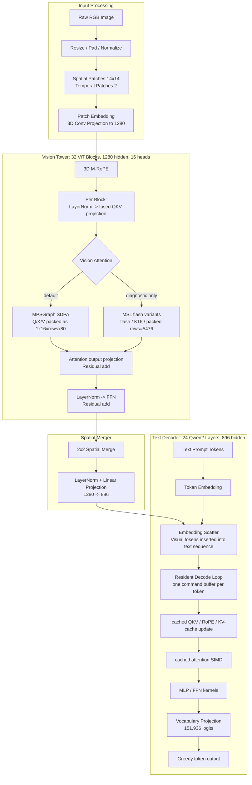
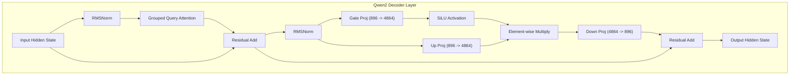

# MinerU (mu) Model Architecture

This document describes the model architecture and data flow of the `mu` engine in `ds4/mineru`. The engine implements a native C execution path for `MinerU2.5-Pro` (specifically based on the `Qwen2-VL-1.2B` vision-language model).

---

## 1. High-Level Pipeline Flow

MinerU executes a **two-step document layout and content extraction pipeline**. Instead of running layout detection and OCR as separate models, it uses a single unified Vision-Language Model (VLM) for both tasks.

```mermaid
flowchart TD
    subgraph Stage 1: Layout Detection
        A[Input Page Image] --> B[Resize, Pad & Normalize]
        B --> C[Vision Tower]
        C --> D[Spatial Merger]
        D --> E[Visual Embeddings (896-dim)]
        E --> F[Text Decoder with 'Layout Detection' Prompt]
        F --> G[Layout JSON Markup Output]
    end

    G --> H[Parse Bounding Boxes & Block Types]

    subgraph Stage 2: Content Extraction (Per Block Loop)
        H --> I[Crop Block Region Image]
        I --> J[Resize, Pad & Normalize Crop]
        J --> K[Vision Tower]
        K --> L[Spatial Merger]
        L --> M[Visual Embeddings (896-dim)]
        M --> N[Text Decoder with Block-Specific OCR Prompt]
        N --> O[Markdown / LaTeX Content Output]
    end

    O --> P[Assemble Final Document JSON & Markdown]
```

---

## 2. Model Architecture Block Diagram

The underlying model is a `Qwen2-VL-1.2B` architecture. It consists of three primary components:
1. **Vision Tower (ViT)**: Processes raw image patches and maps them to visual representations.
2. **Spatial Merger**: Pools and projects visual tokens to align with the text decoder.
3. **Text Decoder**: A 24-layer autoregressive transformer that merges visual tokens and text prompts to generate output.



---

## 3. Detailed Component Breakdown

### A. Vision Tower (Vision Encoder)
The Vision Tower converts image pixels into spatial-temporal tokens:
*   **Dimensions**: Depth = 32 layers, Embedding Dimension = 1280, Heads = 16.
*   **Patch Embedding**: Slides a 3D patch window (temporal $T=2$, vertical $H=14$, horizontal $W=14$) across the image tensor, projecting each patch to a 1280-dimensional embedding.
*   **M-RoPE (Multimodal Rotary Position Embedding)**: Applies positional information along three dimensions (time, vertical, horizontal) to capture the 2D layout structure of the document page.
*   **ViT Layer Structure**:
    ```mermaid
    graph LR
        Input --> LN1[LayerNorm] --> MHA[Multi-Head Attention] --> Add1[Residual Add]
        Add1 --> LN2[LayerNorm] --> FFN[Feed Forward Network] --> Add2[Residual Add] --> Output
    ```

### B. Spatial Merger
The spatial merger reduces the number of visual tokens to accelerate decoder throughput:
*   **Pooling**: Groups 2x2 adjacent spatial tokens into a single combined token.
*   **Projection**: Projects the merged tokens from the 1280-dimensional vision space to the 896-dimensional text decoder space using a simple MLP (LayerNorm + Linear layer).

### C. Text Decoder Layer
The text decoder generates tokens autoregressively:
*   **Dimensions**: Layers = 24, Hidden Size = 896, Intermediate Size = 4864, Attention Heads = 14, KV Heads = 2 (using Grouped Query Attention / GQA).
*   **M-RoPE**: Incorporates 3D positional embeddings for visual tokens and 1D positional embeddings for text tokens.
*   **FFN (SwiGLU)**: Uses gated SiLU activations with three projection matrices: Gate, Up, and Down.



---

## 4. Key Logic & Trace Points in [mu.c](file:///Users/will/github/ds4/mineru/mu.c)

The core operations are mapped to C function calls in [mu.c](file:///Users/will/github/ds4/mineru/mu.c):

1.  **Vision Preprocessing**:
    *   [mu_preprocess_layout_image_file](file:///Users/will/github/ds4/mineru/mu.c) rescales, pads, and normalizes the page image to layout dimension inputs.
2.  **Vision Encoding**:
    *   [mu_vision_patch_embed](file:///Users/will/github/ds4/mineru/mu.c) performs 3D patch embedding.
    *   [mu_vision_rotary_pos_emb](file:///Users/will/github/ds4/mineru/mu.c) constructs positional grids.
    *   [mu_vision_encode](file:///Users/will/github/ds4/mineru/mu.c) runs the ViT stack and the spatial merger.
3.  **Token Generation**:
    *   [mu_text_generate_greedy_with_image_embeds](file:///Users/will/github/ds4/mineru/mu.c) executes the decoder autoregressive loop.
    *   Inside the generation loop, [mu_text_attn_cached](file:///Users/will/github/ds4/mineru/mu.c) uses the KV-cache to perform single-token decode steps without recalculating past context.
4.  **Content Crop OCR Loop**:
    *   [mu_generate_image_region_text](file:///Users/will/github/ds4/mineru/mu.c) isolates layout bounding boxes, crops the region, runs the vision tower, and decodes block-level content (OCR, LaTeX, Markdown).
