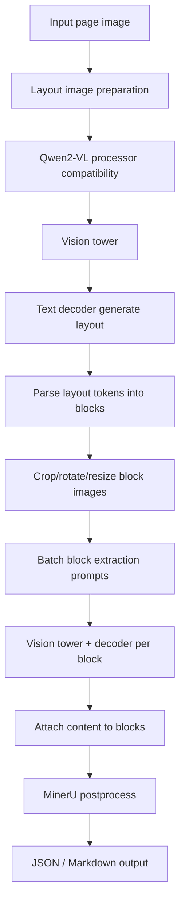

# mineru/mu.c MinerU2.5-Pro Dedicated Engine Design

Date: 2026-06-16
Branch: `codex/mineru-mu-engine`

`mineru/mu.c` is the proposed MinerU2.5-Pro dedicated inference engine. `mu` is short
for MinerU. The goal is to apply the same engineering philosophy as `ds4.c` to a
different model family: narrow model support, strict shape validation,
mmap-backed weights, reference-first correctness, and an optimized accelerator
path only after we can reproduce the official implementation.

This document is a design for the first usable engine. It is not an
implementation plan yet.

## Context

`ds4.c` is a vertical DeepSeek V4 Flash / Pro engine. It owns GGUF parsing,
shape validation, tensor binding, CPU reference execution, Metal/CUDA graph
scheduling, KV cache, tokenizer, sampling, and session APIs. That model-specific
vertical design is the part worth reusing.

MinerU2.5-Pro-2605-1.2B is a different target:

- It is a document parsing VLM, not a chat-only LLM.
- The local model is `Qwen2VLForConditionalGeneration`.
- The model files live in `/Users/will/github/mineru-model/models`.
- The primary weight file is `model.safetensors`, about 2.2 GiB.
- The safetensors header contains 681 tensors, all BF16.
- Tensor groups are roughly `visual.*` for the vision tower and `model.*` for
  the text decoder.
- The working Python reference is in `/Users/will/github/mineru-model`.

Important model dimensions from `config.json`:

| Area | Value |
| --- | ---: |
| Model type | `qwen2_vl` |
| Text layers | 24 |
| Text hidden size | 896 |
| Text attention heads | 14 |
| Text KV heads | 2 |
| Text intermediate size | 4864 |
| Vocab size | 151936 |
| RoPE theta | 1000000.0 |
| M-RoPE section | `[8, 12, 12]` |
| Vision depth | 32 |
| Vision embed dim | 1280 |
| Vision output hidden size | 896 |
| Vision heads | 16 |
| Patch size | 14 |
| Temporal patch size | 2 |
| Spatial merge size | 2 |

## Decision

Do not generalize or mutate `ds4.c` into a multi-model runtime. Build a separate
MinerU engine with `mineru/mu.c` as the main C file.

The reusable idea from DS4 is the vertical slice:

```text
model-specific files
  -> mmap loader
  -> strict metadata and tensor validation
  -> fixed tensor binding table
  -> CPU/reference execution
  -> optimized accelerator execution
  -> narrow public API
  -> CLI or batch driver
```

The DeepSeek-specific mechanisms should stay out of `mineru/mu.c`:

- GGUF DeepSeek V4 tensor layout
- MoE routed experts
- Hyper-Connection state
- compressed KV and indexer KV
- SSD streaming for routed experts
- MTP speculative decoding
- DeepSeek chat/tool renderer

MinerU needs its own fixed mechanics instead:

- safetensors mmap loading
- Qwen2-VL tokenizer and chat template compatibility
- Qwen2-VL image processor compatibility
- vision tower execution
- multimodal placeholder expansion
- M-RoPE position construction
- Qwen2 decoder execution
- MinerU two-step document pipeline

## Design Goals

1. Reproduce the local Transformers implementation before optimizing.
2. Keep the public API document-oriented, not tensor-oriented.
3. Keep `mineru/mu.c` narrow to MinerU2.5-Pro-2605-1.2B at first.
4. Validate every model dimension and tensor shape at load time.
5. Use mmap for the BF16 safetensors file and avoid eager full-weight copies.
6. Make correctness measurable with deterministic trace vectors from the Python
   reference.
7. Make the first version useful on the current MacBook class by avoiding DS4
   large-model assumptions.

## Non-Goals

- No generic safetensors runner.
- No generic Qwen2-VL family runtime in the first version.
- No GGUF conversion requirement in the first version.
- No SSD streaming path in the first version.
- No video support in the first version.
- No sampling diversity in the first version; MinerU uses near-greedy decoding.
- No cross-model abstraction shared with `ds4.c` until duplication proves worth
  extracting.

## Proposed File Layout

The first pass should keep the engine compact but avoid putting unrelated CLI
and tests inside the core file.

```text
mineru/mu.c                 MinerU engine core: loader, binding, CPU reference path,
                     session state, generation, pipeline orchestration.
mineru/mu.h                 Narrow public API for loading a model and parsing pages.
mineru/mu_cli.c             Small command-line driver for smoke tests and page parsing.
mineru/tests/mu_trace.py    Python reference trace dumper using the local
                     Transformers/MinerU implementation.
mineru/tests/mu_test.c      C tests for safetensors parsing, tokenization, image
                     processor shape checks, and trace-vector comparison.
metal/mu_*.metal     Later Metal kernels after the CPU/reference path is stable.
```

The initial implementation may keep more code in `mineru/mu.c` than the final shape,
matching the DS4 style. If `mineru/mu.c` starts to mix too many unrelated concerns, the
first extraction candidates are tokenizer, image preprocessing, and postprocess
helpers.

## Public API Sketch

The API should expose page parsing and low-level generation tests without
leaking tensor internals.

```c
typedef struct mu_engine mu_engine;
typedef struct mu_result mu_result;

typedef enum {
    MU_BACKEND_CPU,
    MU_BACKEND_METAL,
} mu_backend;

typedef struct {
    const char *model_dir;
    mu_backend backend;
    int n_threads;
    int max_new_tokens;
    bool inspect_only;
    bool image_analysis;
} mu_engine_options;

int mu_engine_open(mu_engine **out, const mu_engine_options *opt);
void mu_engine_close(mu_engine *e);
void mu_engine_summary(mu_engine *e);

int mu_parse_image_file(mu_engine *e, const char *path, mu_result **out);
int mu_parse_image_rgb(mu_engine *e, const uint8_t *rgb, int width, int height,
                       int stride, mu_result **out);
void mu_result_free(mu_result *r);
int mu_result_write_json(const mu_result *r, FILE *fp);
int mu_result_write_markdown(const mu_result *r, FILE *fp);
```

The API deliberately starts at image input, because the product value is
document parsing. A lower-level `mu_generate()` helper can exist for tests, but
the CLI should default to the two-step MinerU pipeline.

## End-To-End Data Flow



The first major boundary is between the document pipeline and the VLM engine.
The document pipeline decides which images and prompts to send. The VLM engine
only accepts a prompt plus zero or one RGB image and returns generated text.

## Loader And Tensor Binding

`mineru/mu.c` should read the model directory directly:

```text
config.json
preprocessor_config.json
generation_config.json
tokenizer.json
vocab.json
merges.txt
added_tokens.json
special_tokens_map.json
chat_template.jinja
model.safetensors
```

The first loader should support the local single-file safetensors case. It
should:

1. mmap `model.safetensors`.
2. parse the safetensors header.
3. validate that every tensor is BF16.
4. validate the expected tensor count and known prefixes.
5. bind required tensors into fixed structs.
6. fail early on missing, extra-critical, wrong-shape, or wrong-dtype tensors.

Text layer binding should map names such as:

```text
model.embed_tokens.weight
model.norm.weight
model.layers.N.input_layernorm.weight
model.layers.N.self_attn.q_proj.weight
model.layers.N.self_attn.q_proj.bias
model.layers.N.self_attn.k_proj.weight
model.layers.N.self_attn.k_proj.bias
model.layers.N.self_attn.v_proj.weight
model.layers.N.self_attn.v_proj.bias
model.layers.N.self_attn.o_proj.weight
model.layers.N.mlp.gate_proj.weight
model.layers.N.mlp.up_proj.weight
model.layers.N.mlp.down_proj.weight
model.layers.N.post_attention_layernorm.weight
```

Vision binding should map:

```text
visual.patch_embed.proj.weight
visual.blocks.N.norm1.weight
visual.blocks.N.norm1.bias
visual.blocks.N.attn.qkv.weight
visual.blocks.N.attn.qkv.bias
visual.blocks.N.attn.proj.weight
visual.blocks.N.attn.proj.bias
visual.blocks.N.norm2.weight
visual.blocks.N.norm2.bias
visual.blocks.N.mlp.fc1.weight
visual.blocks.N.mlp.fc1.bias
visual.blocks.N.mlp.fc2.weight
visual.blocks.N.mlp.fc2.bias
visual.merger.ln_q.weight
visual.merger.ln_q.bias
visual.merger.mlp.0.weight
visual.merger.mlp.0.bias
visual.merger.mlp.2.weight
visual.merger.mlp.2.bias
```

The exact final list should be generated from the local safetensors header and
locked by tests.

## Processor Compatibility

The processor is part of the model contract. It cannot be treated as incidental
Python glue.

`mineru/mu.c` needs compatibility with these behaviors:

- chat template renders a system message, a user message with optional image
  token, and an assistant generation prefix.
- default system prompt is `You are a helpful assistant.`
- image-before-text is the default for MinerU.
- image placeholder text uses
  `<|vision_start|><|image_pad|><|vision_end|>`.
- the processor replaces a single image pad token with the number of visual
  tokens implied by `image_grid_thw.prod() / merge_size^2`.
- output decoding keeps MinerU structural special tokens, but removes
  BOS/EOS/PAD from generated token ids.

Image preprocessing must match Qwen2-VL:

1. convert input to RGB.
2. resize according to Qwen2-VL min/max pixel rules and patch/merge factor.
3. rescale and normalize with the configured mean/std.
4. add temporal dimension and repeat the last frame to satisfy temporal patch
   size 2.
5. reorder patches exactly like the fast image processor:

```text
(batch, grid_t, temporal_patch, channel,
 grid_h / merge, merge, patch,
 grid_w / merge, merge, patch)
  -> permute
(batch, grid_t, grid_h / merge, grid_w / merge,
 merge_h, merge_w, channel, temporal_patch, patch_h, patch_w)
  -> flatten
```

The output of this stage is:

```text
input_ids
attention_mask
pixel_values
image_grid_thw
```

This stage is high risk. The first implementation should be trace-driven and
compare C output against the Python processor before running the model.

## Model Execution

The model has two main compute parts.

### Vision Tower

The vision path is:

```text
pixel_values
  -> Conv3D patch embedding
  -> 32 vision transformer blocks
  -> patch merger
  -> image embeddings in text hidden size
```

The vision attention is non-causal. RoPE is applied to vision query/key states
using the Qwen2-VL vision rotary embedding. For the first reference path,
attention can be implemented eagerly in float32 accumulation and converted back
to BF16/float as needed.

### Text Decoder

The text path is:

```text
token embedding
  -> scatter image embeddings into image-token positions
  -> 24 decoder layers
  -> final RMSNorm
  -> tied lm_head / embed_tokens projection
  -> logits
```

Each decoder layer is standard Qwen2 style:

```text
RMSNorm
  -> q/k/v projection with q/k/v bias
  -> M-RoPE on q/k
  -> grouped-query causal attention
  -> output projection
  -> residual
  -> RMSNorm
  -> SwiGLU MLP
  -> residual
```

The current non-ICB Metal decode path implements the SwiGLU MLP with the shared
SIMDGroup SwiGLU helper, followed by the down projection and residual add. The
old monolithic decode FFN kernel remains available with
`MU_TEXT_DECODE_FFN_NO_SIMDGROUP=1`.
The ICB decode path records the same FFN sequence by default; its old
monolithic FFN command remains available with
`MU_TEXT_DECODE_ICB_FFN_NO_SIMDGROUP=1`.

The text decoder needs a normal KV cache for generation. There is no DeepSeek
compressed KV path. For MinerU page and block prompts, context lengths are
expected to be modest enough that a straightforward per-layer KV cache is fine
for the first version.

## M-RoPE Position Handling

Qwen2-VL uses three position streams: temporal, height, and width.

For text-only prompts, all three streams are the same 1D positions. For image
prompts:

1. Text before the image gets ordinary 1D positions.
2. The image token span gets a 3D grid derived from `image_grid_thw` and
   `spatial_merge_size`.
3. Text after the image starts at one plus the maximum image position.
4. During cached decode, new token positions use the stored `rope_delta`.

This must match `get_rope_index()` from the Transformers model. A one-token
position mismatch can produce valid-looking but wrong layout boxes, so this
gets its own trace tests.

## MinerU Pipeline

The engine should expose the same core pipeline as `MinerUClient.two_step_extract`.

### Layout Detection

1. Convert page to RGB.
2. Resize to fixed layout image size `1036 x 1036`.
3. Prompt with `"\nLayout Detection:"`.
4. Generate layout markup.
5. Parse layout blocks with the MinerU bbox/ref/rotation grammar.

The layout parser should:

- accept bbox coordinates in 0..1000 integer space.
- normalize bbox to 0..1.
- map `unknown` to `image`.
- skip `inline_formula`.
- parse rotation tokens.
- parse `txt_contd_tgt` as `merge_prev`.
- filter text/equation blocks covered by tables.

### Content Extraction

For each layout block:

1. crop from the original full-resolution page using normalized bbox.
2. skip block types that MinerU does not extract directly.
3. skip image/chart blocks unless `image_analysis` is enabled.
4. rotate by parsed angle when needed.
5. expand tiny or extreme-aspect crops like MinerU's `resize_by_need`.
6. choose prompt by block type:

| Block type | Prompt |
| --- | --- |
| `table` | `"\nTable Recognition:"` |
| `equation` | `"\nFormula Recognition:"` |
| `image` | `"\nImage Analysis:"` |
| `chart` | `"\nImage Analysis:"` |
| default | `"\nText Recognition:"` |

Then batch the block VLM calls by compatible sampling params where possible.

### Postprocess

The first C version can implement the minimal postprocess needed to produce
correct block JSON and usable Markdown. More elaborate table-image absorption,
formula wrapping, and cross-page table merge can be added after the core
two-step output matches the Python reference.

## Decoding Policy

MinerU's local Transformers wrapper effectively runs near-greedy:

- layout sampling params default to temperature 0.0, top_k 1.
- generation config uses temperature 0.01, top_k 1, top_p 0.001.
- practical behavior should be greedy argmax.

The first engine should implement greedy generation, EOS/PAD stopping, and
`max_new_tokens`. Repetition penalty and no-repeat-ngram behavior can be added
only if trace comparisons show they affect local output under the chosen
commands.

## Validation Strategy

Correctness should be built around Python trace vectors, not visual inspection.

Add a Python trace dumper in `/Users/will/github/mineru-model` or `tests/` that
can emit JSON/NPY artifacts for:

- rendered chat prompt string.
- `input_ids`.
- `attention_mask`.
- `pixel_values` shape and selected sample values.
- `image_grid_thw`.
- expanded image-token count.
- `position_ids`.
- first forward logits top-k.
- generated token ids for layout detection.
- parsed layout blocks.
- one cropped block extraction trace.

Then build C tests in stages:

1. safetensors header parse and tensor binding.
2. tokenizer and chat-template output.
3. image processor shape and sample-value comparison.
4. M-RoPE position comparison.
5. vision tower output comparison on a tiny image.
6. text-only first-token logits comparison.
7. image+text first-token logits comparison.
8. layout generation token comparison.
9. end-to-end page JSON/Markdown comparison.

All numerical tests should define tolerances per stage. Processor and token ids
should be exact. Logits can use top-k agreement plus bounded absolute/relative
error while BF16 and math-kernel differences are being stabilized.

## Implementation Phases

### Phase 1: Reference Harness

Create deterministic Python traces from the already-working Transformers
implementation. This phase defines the contract for `mineru/mu.c`.

Deliverables:

- trace script.
- sample page trace.
- text-only trace.
- one page layout trace.
- one block extraction trace.

### Phase 2: Loader And Metadata

Implement safetensors mmap parsing and strict binding in C.

Deliverables:

- `mineru/mu.c` / `mineru/mu.h` skeleton.
- model directory loader.
- config and preprocessor validation.
- tensor table dump in inspect mode.
- tests for tensor count, dtype, and shapes.

### Phase 3: Processor Compatibility

Implement tokenizer, chat template subset, image preprocessing, placeholder
expansion, and M-RoPE position construction.

Deliverables:

- exact `input_ids` match.
- exact `image_grid_thw` match.
- close `pixel_values` match.
- exact `position_ids` match.

### Phase 4: CPU Reference Inference

Implement BF16-backed CPU reference execution. CPU is for correctness, not the
final speed target.

Deliverables:

- text-only first-token logits.
- image+text first-token logits.
- greedy generation for layout prompt.
- KV cache decode.

### Phase 5: MinerU Pipeline

Implement layout detection, block cropping, block extraction prompts, and JSON /
Markdown output.

Deliverables:

- `mu_cli --image page.png --json`.
- `mu_cli --image page.png --markdown`.
- end-to-end comparison against the Python `MinerUClient.two_step_extract`.

### Phase 6: Metal Path

Move hot kernels to Metal once the reference path is stable.

Initial Metal candidates:

- dense matmul for BF16 weights.
- RMSNorm and LayerNorm.
- Qwen2 attention.
- vision attention.
- SwiGLU MLP.
- output projection top-k.

The Metal path should share the same public API and use the CPU path as a debug
reference.

### Phase 7: Size And Speed Optimizations

Only after correctness is stable:

- DO NOT quantize weights. Quantization is strictly prohibited in the mu engine to prevent precision loss.
- optionally convert BF16 safetensors to a project-native packed format (maintaining exact BF16/FP32 precision).
- add graph scheduling and buffer reuse.
- batch block extraction more aggressively.
- tune for MPS/Metal memory behavior on small unified-memory machines.

## Error Handling

Load-time errors should be explicit and early:

- missing model directory file.
- unsupported model type.
- unsupported tensor dtype.
- wrong model dimensions.
- missing required tensor.
- unexpected tensor shape.
- tokenizer special-token mismatch.
- image processor config mismatch.

Runtime errors should name the pipeline stage:

- image decode failure.
- processor failure.
- generation limit reached without EOS.
- malformed layout output.
- invalid crop bbox.
- postprocess failure.

The document parser should keep partial layout information when content
extraction fails for one block, but the low-level VLM call should fail hard on
shape or memory errors.

## Open Risks

- Tokenizer compatibility is more work than it looks; `tokenizer.json` support
  needs careful BPE behavior and special-token handling.
- Image preprocessing must match fast Qwen2-VL patch ordering exactly.
- M-RoPE position handling is easy to get subtly wrong.
- Vision tower execution may dominate runtime on CPU before Metal exists.
- Markdown parity depends on MinerU postprocess behavior, not just model output.
- The local Python reference uses package behavior from installed
  `transformers` and `mineru_vl_utils`; version drift should be pinned in trace
  metadata.

## Success Criteria

The design is successful when `mineru/mu.c` can:

1. load `/Users/will/github/mineru-model/models` without Python;
2. reproduce Python processor outputs for the sample page;
3. reproduce first-token logits closely enough for text-only and image prompts;
4. generate layout markup matching the Python reference under greedy decoding;
5. parse a page into JSON blocks;
6. output usable Markdown for the same sample pages used by
   `benchmark_pdf.py`;
7. keep DS4 behavior unchanged.

## Immediate Next Step

Keep the decoder work data-backed: the faster FFN sequence is now default
inside the ICB recording path, with the old path kept behind
`MU_TEXT_DECODE_ICB_FFN_NO_SIMDGROUP=1`. Cached-attention recompute and smaller
score-buffer probes were correctness-clean but not stable wins. ICB QKV/RoPE
fusion is now default after trace-clean adjacent A/B; the old ICB path remains
available with `MU_TEXT_DECODE_QKV_ROPE_NO_FUSION=1`. Its timing win is modest
and noisy, but the dispatch reduction is stable. Next, either attempt a larger
KV-group attention redesign or move back to vision FFN.
