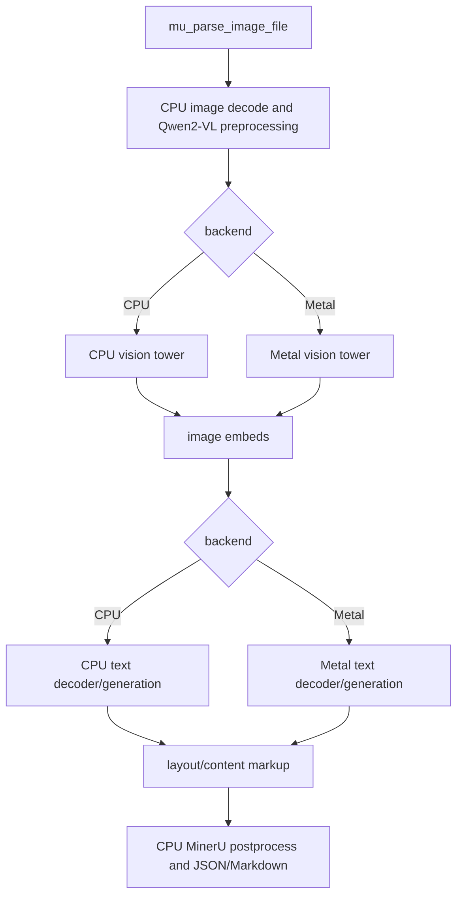
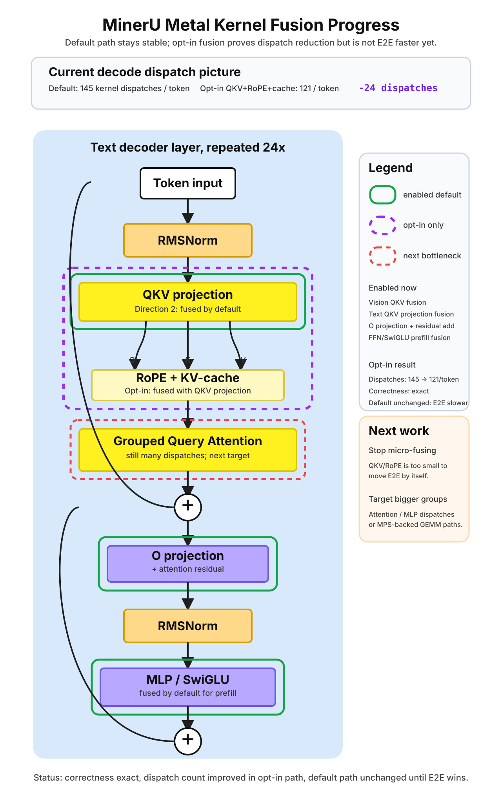

# mineru/mu.c Metal Backend Design

Date: 2026-06-17
Branch: `codex/mineru-mu-engine`

This document designs the Metal acceleration path for `mineru/mu.c`. The CPU
path must remain in the tree and continue to be the precision reference for
trace checks, page smoke tests, and backend parity debugging.

## Goal

Add a native Metal backend for MinerU2.5-Pro-2605-1.2B without turning `mu.c`
into a generic VLM runtime.

The Metal backend should accelerate the existing fixed model path:

```text
Qwen2-VL image preprocessing
  -> vision tower
  -> multimodal token embedding scatter
  -> Qwen2 text decoder
  -> greedy layout/content generation
  -> MinerU postprocess
```

The CPU backend remains authoritative for correctness. Metal may become the
default performance backend later, but it must never be the only executable
path.

## Non-Goals

- Do not remove or weaken the CPU implementation.
- Do not merge MinerU Metal code into DS4 Metal code.
- Do not introduce DS4 SSD streaming; MinerU2.5-Pro is a dense Qwen2-VL model.
- Do not quantize weights. Quantization is strictly prohibited in the mu engine to prevent precision loss; all weights must be stored and computed using BF16/FP32.
- Do not make the backend generic across arbitrary Qwen2-VL checkpoints.
- Do not require Metal for tests that are meant to run on non-macOS machines.

## Backend Contract

`mu_engine_options.backend` already exposes:

```c
typedef enum {
    MU_BACKEND_CPU = 0,
    MU_BACKEND_METAL = 1,
} mu_backend;
```

The public API should stay stable:

```c
int mu_engine_open(mu_engine **out, const mu_engine_options *opt);
int mu_parse_image_file(mu_engine *e, const char *path, mu_result **out);
int mu_text_top_logits(...);
int mu_vision_encode(...);
```

Backend selection is an implementation detail behind the same functions:

- `MU_BACKEND_CPU` calls the current C/Accelerate reference kernels.
- `MU_BACKEND_METAL` calls Metal kernels for implemented stages.
- Unimplemented Metal stages may temporarily fall back to CPU only while a
  milestone is in progress.
- Benchmark mode must be able to reject CPU fallback so performance numbers are
  honest.

Recommended CLI surface:

```bash
./mu --backend cpu --check-trace mineru/tests/mu-traces/layout.json
./mu --backend metal --check-trace mineru/tests/mu-traces/layout.json
./mu --backend metal --no-cpu-fallback --image page.png --json
./mu --compare-backends --image page.png --json
```

`--compare-backends` should run CPU and Metal on the same input and report
structured deltas without changing the JSON result format used by normal
callers.

## Proposed File Layout

Keep MinerU-specific acceleration files inside `mineru/`:

```text
mineru/mu.c                  Existing CPU/reference engine and backend dispatch.
mineru/mu.h                  Public API and backend enum.
mineru/mu_gpu.h              Opaque Metal backend interface used by mu.c.
mineru/mu_metal.m            Objective-C Metal device, pipeline, buffers, dispatch.
mineru/metal/mu_dense.metal  BF16/f32 dense kernels and top-k helpers.
mineru/metal/mu_norm.metal   RMSNorm, LayerNorm, residual/add kernels.
mineru/metal/mu_attn.metal   Qwen2 text attention and KV-cache decode kernels.
mineru/metal/mu_vision.metal Qwen2-VL vision attention, MLP, merge kernels.
```

The Makefile should introduce a separate MinerU Metal source set, for example:

```make
MU_METAL_SRCS := $(wildcard mineru/metal/*.metal)
```

This avoids coupling `mu` to DS4's root `metal/*.metal` glob and keeps the DS4
build graph untouched.

## High-Level Architecture



The document pipeline, tokenizer, image decode, PDF rendering, crop logic,
layout parser, JSON writer, and Markdown writer should stay CPU-side. Metal
only owns tensor compute.

## CPU Reference Policy

CPU is not a temporary scaffolding path. It is the precision contract.

Required policy:

- `MU_BACKEND_CPU` remains the default backend until Metal parity and benchmark
  gates are consistently green.
- `make mu-test` continues to exercise CPU by default.
- Every Metal milestone must compare against CPU and the existing Transformers
  traces.
- CPU implementations of tokenizer, image preprocessing, vision trace probes,
  text logits, greedy generation, layout parser, and page smoke tests stay
  buildable on macOS without Metal-specific compile flags.
- No shared helper should silently change CPU numerical behavior to simplify a
  Metal kernel.

The CPU path is allowed to be slow. Its job is reproducibility, debuggability,
and a stable fallback when Metal results drift.

## Metal Runtime Objects

Add an opaque runtime owned by `mu_engine`:

```c
typedef struct mu_gpu mu_gpu;

int mu_gpu_create(mu_gpu **out, const mu_engine *engine, bool allow_cpu_fallback);
void mu_gpu_destroy(mu_gpu *gpu);
```

`mu_gpu` should own:

- `id<MTLDevice>`
- `id<MTLCommandQueue>`
- compiled `id<MTLLibrary>`
- named `id<MTLComputePipelineState>` objects
- persistent or lazy weight buffers
- reusable activation scratch buffers
- optional debug counters for CPU fallback and bytes moved

`mu.c` should not include Metal headers. It should call narrow C functions from
`mu_gpu.h`, keeping Objective-C isolated in `mu_metal.m`.

## Weight And Buffer Strategy

The model is currently loaded from BF16 safetensors through mmap. Keep that
loader as the single source of truth.

Initial strategy:

1. Keep all weights mmap-backed for CPU.
2. Lazily stage each tensor to a `MTLBuffer` the first time a Metal kernel needs
   it.
3. Use `MTLResourceStorageModeShared` on Apple Silicon.
4. Cache staged buffers for the lifetime of `mu_engine`.
5. Keep activation scratch buffers separate from weight buffers.

Later optimization:

- Use `newBufferWithBytesNoCopy` for aligned mmap tensor slices when lifetime
  and alignment are safe.
- Group frequently used layer weights into per-layer buffer tables.
- Add an activation arena or `MTLHeap` after kernel shapes stabilize.

This preserves CPU access while avoiding an up-front GPU copy of every tensor
before the first request.

## Kernel Scope

### Dense BF16 Matmul

Priority: highest.

Needed by both vision and text paths:

- patch embedding
- Q/K/V/O projections
- MLP gate/up/down projections
- vision merger MLP
- lm head / top-k path

First implementation can accumulate in f32 and write f32 activations. Weight
input remains BF16.

### Norms And Elementwise Kernels

Needed kernels:

- RMSNorm for text decoder
- LayerNorm for vision tower
- residual add
- SiLU and SwiGLU
- rotary embedding application
- embedding scatter for image placeholders

These should be small, simple kernels with CPU comparison tests at fixed trace
points.

### Vision Tower

The vision tower is a major hot path and a strong first end-to-end Metal target.
It has fixed shapes for current 120dpi page traces, but the implementation
should accept the dynamic `grid_t/grid_h/grid_w` already produced by the CPU
preprocessor.

Metal vision stages:

```text
pixel_values
  -> patch_embed
  -> rotary_pos_emb
  -> 32 vision blocks
  -> spatial merge
  -> projector to text hidden size
```

Trace probes should remain available:

- patch embedding sample
- rotary sample
- block0 norm/qkv/attention/output samples
- final image embedding sample

### Text Decoder

The first Metal decoder version can run full prefill like the current CPU path.
After parity, add KV-cache decode.

Stages:

```text
token/image embeddings
  -> M-RoPE position application
  -> 24 decoder layers
  -> final RMSNorm
  -> lm head top-k
```

KV-cache decode should be a later milestone because it changes execution
structure more than a pure kernel port.

## Dispatch Boundary

Keep high-level functions in `mu.c` and dispatch at stage boundaries:

```text
mu_vision_encode()
  if backend == metal and gpu vision ready:
      mu_gpu_vision_encode(...)
  else:
      mu_cpu_vision_encode(...)

mu_text_generate_greedy_with_image_embeds()
  if backend == metal and gpu decoder ready:
      mu_gpu_text_generate(...)
  else:
      mu_cpu_text_generate(...)
```

Do not scatter backend checks inside every math helper. Stage-level dispatch
makes it easier to compare outputs and easier to disable fallback for benchmark
runs.

## Fallback Rules

During development:

- `--backend metal` may fall back to CPU for incomplete stages.
- fallback must be counted and visible in `mu_engine_summary()`.
- `MU_METAL_DEBUG=1` may print fallback stage names to stderr.

For performance tests:

- `--no-cpu-fallback` must fail if any required Metal stage is missing.
- performance reports must state whether fallback was allowed.

For correctness tests:

- CPU trace checks always run first.
- Metal trace checks run only on machines with a Metal device.
- If Metal is unavailable, tests should skip Metal-specific checks with an
  explicit message, not fail CPU verification.

## Parity Gates

Every milestone needs two kinds of gates: local tensor probes and task-level
outputs.

Required CPU gates:

```bash
make mu-test
make mu
./mu --backend cpu --check-trace mineru/tests/mu-traces/text.json
./mu --backend cpu --check-trace mineru/tests/mu-traces/layout.json
/Users/will/github/mineru-model/.venv/bin/python mineru/tests/mu_cli_smoke.py
```

Required Metal gates on macOS with Metal:

```bash
./mu --backend metal --check-trace mineru/tests/mu-traces/text.json
./mu --backend metal --check-trace mineru/tests/mu-traces/layout.json
./mu --backend metal --no-cpu-fallback --image /path/to/page.png --json
```

Recommended parity thresholds:

| Boundary | Requirement |
| --- | --- |
| tokenizer / position ids | exact |
| image preprocessing | exact shape, close f32 values |
| vision trace samples | close f32 values with documented tolerance |
| text logits | top-1 token exact, top-8 overlap >= 6 |
| generated text for smoke pages | exact token sequence where deterministic |
| page blocks | exact count and ordered types |
| bbox/content | no worse than current CPU-vs-Transformers report |

The tolerance should be documented per kernel once the first Metal results are
measured. Avoid setting a single global float tolerance before seeing real
accumulation drift.

## Benchmark Protocol

The existing baseline is recorded in:

```text
mineru/docs/mu-performance-report.md
```

Metal benchmark runs should reuse the same 10 pages:

```text
224, 234, 237, 241, 244, 247, 258, 281, 303, 334
```

Report all of these:

- CPU reference time
- Metal time with fallback disabled
- Transformers/MPS reference time
- block-count accuracy
- type accuracy
- bbox IoU
- content token F1
- table cell recall
- Metal fallback count, expected to be zero in benchmark mode

Do not compare a fallback-enabled Metal run against Transformers as if it were
a real Metal speed number.

## Advanced Performance Optimization Strategy (Closing the MPS/Transformers Gap)



Current kernel fusion status: default fusions are kept only when they help the
same-run benchmark, while the QKV + RoPE + KV-cache fusion remains opt-in
because it reduces dispatches (`145 -> 121/token`) but did not improve E2E time.

### Metal Performance Primitives Guide Takeaways

Reference: [Metal Performance Primitives Programming Guide](https://developer.apple.com/download/files/Metal-Performance-Primitives-Programming-Guide.pdf),
Version 1, 2026-03-16.

The local optimization machine is an Apple M5 MacBook Pro with 16 GB unified
memory (`sysctl machdep.cpu.brand_string` reports `Apple M5`), so the guide's
M5 tuning notes are directly relevant to local benchmarks. Keep any MPP/Metal 4
implementation behind runtime capability checks so the repo remains buildable
and testable on older Apple Silicon machines. Useful takeaways for the current
backend:

- Prefer fixed-shape or function-constant kernels for stable dimensions such as
  `hidden=896`, `inter=4864`, and vision `1280`; static extents reduce bounds
  checking in tensor operations.
- Use postfix fusion when replacing GEMM/GEMV kernels: bias, residual add,
  activation, and SwiGLU should happen before the matmul result round-trips
  through device memory.
- Do not assume threadgroup-memory staging is automatically faster on Apple
  GPUs. The guide explicitly favors direct device-memory access plus cache
  behavior for optimized GEMM kernels, with staging only when measurements prove
  it helps.
- For large GEMM-style work, start tile tuning near `2x2` simdgroups per
  threadgroup and `32x32` simdgroup tiles for 16-bit operands, then benchmark
  the actual model shapes.
- Consider Morton-style threadgroup walk order for 2D tiled GEMM or attention
  kernels to improve last-level-cache locality.
- Use roofline/arithmetic-intensity reasoning before writing another fusion:
  token-by-token decode GEMV is likely memory-bound, while larger prefill and
  vision GEMMs are better candidates for MPP/tensor_ops experiments.

Per-kernel/group GPU timing has now been added behind
`MU_TEXT_DECODE_PROFILE_SPLIT=1`. The diagnostic path keeps the default
resident decoder unchanged, but splits each decode layer into labeled command
buffers for QKV, attention, O projection, and fused MLP, then records Metal GPU
timestamps through `MU_LATENCY_PROFILE=1`.

2026-06-23 trace results:

| Trace | QKV | Attention | O projection | MLP | Logits | Main signal |
| --- | ---: | ---: | ---: | ---: | ---: | --- |
| Text trace split GPU time | 22.1% | 7.2% | 2.9% | 59.1% | 8.7% | fused FFN is the text-only hotspot |
| Layout trace split GPU time | 4.0% | 78.2% | 0.9% | 14.0% | 2.9% | cached attention dominates the VL path |

Decision: for MinerU's VL/layout workload, continue the current MSL/MPS route
with attention as the next primary optimization target. A small MPP/tensor_ops
prototype remains useful for the text-only fused FFN/MLP hotspot, but it should
not replace the attention work as the main next step.

The first action from that decision is to promote the existing cached-attention
SIMD path to the default. The older scalar cached-attention implementation stays
available through `MU_TEXT_ATTN_CACHED_NO_SIMD=1`; `MU_USE_SIMD=1` remains only
for the older dense/debug SIMD paths.

2026-06-23 promotion check:

| Layout trace path | Attention GPU ms | Decode GPU ms | Decode wall time |
| --- | ---: | ---: | ---: |
| Default cached attention SIMD | 48.094 | 117.637 | 0.205455s |
| `MU_TEXT_ATTN_CACHED_NO_SIMD=1` | 286.502 | 355.603 | 0.506507s |

This keeps the optimization strategy conservative: make the measured hot path
fast by default, keep a narrow rollback switch, then decide whether the next
attention step should be deeper MSL tiling/fusion or an MPSGraph/MPS SDPA-style
prototype. MPP/tensor_ops remains a secondary experiment for text-only MLP,
where the split profile points instead of layout attention.

2026-06-23 vision attention update: the bounded MPSGraph SDPA prototype passed
the 10-page gate and is now the default vision attention path. It only replaces
the attention segment in `mu_gpu_vision_encode`: Q/K/V are packed to
`[1,16,rows,80]`, MPSGraph runs scaled-dot-product attention, and the result is
reshaped back to `[rows,1280]`. The previous flash/K16/no-flash path remains
available through `MU_VISION_ATTN_NO_MPSGRAPH=1`. The measured 10-page result
improved from `651.6244s` to `565.2294s` with exact output parity.

To achieve parity or superior performance compared to PyTorch/MPS and Apple MLX, the Metal backend can adopt the design principles established by `ggml-metal` and `mlx`:

### 1. End-to-End GPU Residency (Eliminating CPU-GPU Syncs)
- **Problem**: PyTorch/MPS and MLX execute the entire forward pass completely on the GPU without host-device round-trips. In contrast, our current implementation schedules the network block-by-block from the CPU (`mu.c`), which commits the command buffer and waits (`waitUntilCompleted`) after each block or layer. This introduces substantial CPU-GPU synchronization latency (~50-100μs per sync), which accumulates significantly across 32 vision blocks and 24 text decoder layers (especially during step-by-step autoregressive generation).
- **Strategy**: Refactor the control loop in `mu.c` and `mu_metal.m` to transition to a non-blocking model:
  - Chain all block/layer dispatches (e.g., all 32 layers of the vision tower) inside a single `MTLCommandBuffer` or a minimized set of buffers.
  - Keep intermediate activations entirely within GPU-resident scratch buffers rather than copying them back to CPU.
  - Commit and wait only once at the end of the full stage (e.g., when retrieving final image embeddings or greedily sampling the next token logits).

### 2. Zero-Copy Memory Integration (Unified Memory Optimization)
- **Problem**: Moving input and output tensors between standard CPU memory allocations and GPU-managed buffers incurs overhead.
- **Strategy**: Leverage Apple Silicon's unified memory architecture by wrapping page-aligned CPU memory directly into `MTLBuffer` objects using `newBufferWithBytesNoCopy:length:options:deallocator:` (similar to `ggml-metal`'s memory strategy). This allows CPU and GPU to share the same physical memory space, eliminating copies.

### 3. SIMDgroup Matrix Co-Processor Acceleration
- **Problem**: High-level frameworks like MPS often suffer from compile/warmup overhead or restrict custom kernel fusion. Custom elementwise implementations are memory-bound.
- **Strategy**: Borrow optimization techniques from `mlx` and `ggml-metal` by using Metal Shading Language (MSL) `simdgroup_matrix` primitives. This allows threadgroups of 32 threads (a SIMDgroup) to collaboratively compute GEMM operations directly on Apple Silicon's matrix coprocessors, achieving near-peak hardware performance.

### 4. Fully Fused Attention Kernels (FlashAttention)
- **Problem**: While fused softmax + PV (`mu_vision_softmax_pv_head`) avoids materializing the intermediate probability matrix $P$, it does not tile $Q$ and $K$ loading.
- **Strategy**: Design a fully tiled 2D FlashAttention MSL kernel (referencing `ggml-metal.metal`'s `kernel_flash_attn_ext` and MLX SDPA implementations) that tiles Query ($Q$), Key ($K$), and Value ($V$) loading inside threadgroup memory (SRAM), entirely avoiding VRAM round-trips for the attention scoring loop.

### 5. Native FP16/Half-Precision Pipeline (vs. current BF16->FP32 Upcast)
- **Problem**: Currently, the Metal backend caches BF16 weights as FP32 buffers and runs FP32 MPS GEMMs to bypass layout restrictions. This doubles memory bandwidth usage (the primary bottleneck on Apple Silicon) and halves execution throughput, since Apple Silicon GPU's native FP16/half-precision matrix math has twice the throughput of FP32.
- **Strategy**: Migrate the entire GPU activation and weight execution path to FP16/half precision (`half` and `half4` types in MSL). Embellish this with native half-precision MPS calls (using `MPSDataTypeFloat16`) to halve the bandwidth footprint and unlock native double-speed FP16 GPU arithmetic.

### 6. Transient Buffer Reuse via `MTLHeap` (Resource Aliasing)
- **Problem**: Layer-by-layer execution allocates individual activation scratch buffers, leading to higher memory consumption and driver allocation overhead.
- **Strategy**: Use `MTLHeap` to allocate a single unified transient memory pool for activations. Employ **resource aliasing** so that subsequent layers (e.g., Layer $N$) reuse the exact same physical memory address space as prior layers (e.g., Layer $N-1$) for their temporary buffers, minimizing memory footprint and improving L2 cache locality.

### 7. Indirect Command Buffers (ICB) for Autoregressive Decoding
- **Problem**: Autoregressive decoding submits the same sequence of kernels (RMSNorm, GEMM, Attention, etc.) at every token generation step. Encoding these command buffers on the CPU repeatedly adds host-side encoding overhead.
- **Strategy**: Pre-record the entire sequence of decoder execution commands into an **Indirect Command Buffer (ICB)** during initialization. During each generation step, the CPU simply updates dynamic parameters (like KV-cache offsets) and commands the GPU to execute the ICB, reducing CPU encoding overhead to zero.

### 8. Precompiled Metal Shader Libraries (`.metallib`)
- **Problem**: Loading Metal kernels from source strings at runtime via JIT compilation (`newLibraryWithSource`) introduces startup delays and stutter.
- **Strategy**: Compile `.metal` source files to binary `.metallib` files at build time using the Xcode Command Line tools (`xcrun -sdk macosx metal`). Load the pre-compiled `.metallib` directly at startup, eliminating JIT compilation overhead.

## Implementation Milestones

### Milestone 1: Backend Shell

Add `mineru/mu_gpu.h`, `mineru/mu_metal.m`, and `mineru/metal/`.

Acceptance:

- `./mu --backend cpu --inspect` still works.
- `./mu --backend metal --inspect` creates a Metal device and prints backend
  state.
- CPU tests still pass.
- Metal unavailable path is explicit and clean.

### Milestone 2: Dense And Norm Kernels

Move isolated dense, norm, and elementwise helpers behind Metal probes.

Acceptance:

- kernel-level samples match CPU within documented tolerances.
- text trace still passes on CPU.
- Metal text logits pass with fallback allowed only for not-yet-ported stages.

### Milestone 3: Vision Tower

Move `mu_vision_encode()` to Metal.

Acceptance:

- vision trace probes pass.
- layout trace logits pass using Metal image embeddings.
- CPU vision path still passes the same trace.

### Milestone 4: Text Decoder Full Prefill

Move full-prefill decoder generation to Metal.

Acceptance:

- text trace logits and generation pass with Metal.
- layout generation pass with Metal vision plus Metal decoder.
- no CPU fallback for dense/norm/attention in benchmark mode.

### Milestone 5: KV-Cache Decode

Add a Metal KV-cache decode path for repeated generation.

Acceptance:

- greedy outputs remain stable.
- page-level JSON/Markdown stays unchanged against CPU for smoke pages.
- benchmark shows a meaningful speedup over full-prefill Metal.

### Milestone 6: End-To-End Benchmark

Rerun the 10-page benchmark and update the performance report.

Acceptance:

- benchmark uses `--backend metal --no-cpu-fallback`.
- accuracy is no worse than the current CPU baseline on sampled pages.
- performance report clearly lists hardware, fallback count, and page timings.

## Risks

| Risk | Mitigation |
| --- | --- |
| Metal numerical drift changes generated tokens | Keep CPU reference and compare logits before generation. |
| GPU memory pressure on 16GB unified memory | Lazy weight staging, reusable scratch buffers, no eager all-tensor upload at first. |
| Stage fallback hides performance gaps | Count fallback and require `--no-cpu-fallback` for benchmarks. |
| Metal code becomes tangled with CPU code | Keep Objective-C in `mu_metal.m` and dispatch only at stage boundaries. |
| Vision dynamic shapes cause pipeline churn | Compile generic kernels and specialize by constants only after stable profiling. |
| CPU path regresses while optimizing Metal | Always run CPU trace checks before Metal checks. |

## Design Decision

Proceed with a dual-backend architecture:

- CPU stays as the correctness reference and default stable path.
- Metal is added as a separate MinerU-specific backend under `mineru/`.
- Stage-level dispatch chooses CPU or Metal without changing the public API.
- Benchmarks only count Metal speed when CPU fallback is disabled.

This gives us a clean path to speed while preserving the thing that made the
current `mu.c` work: deterministic comparison against a trusted reference.
