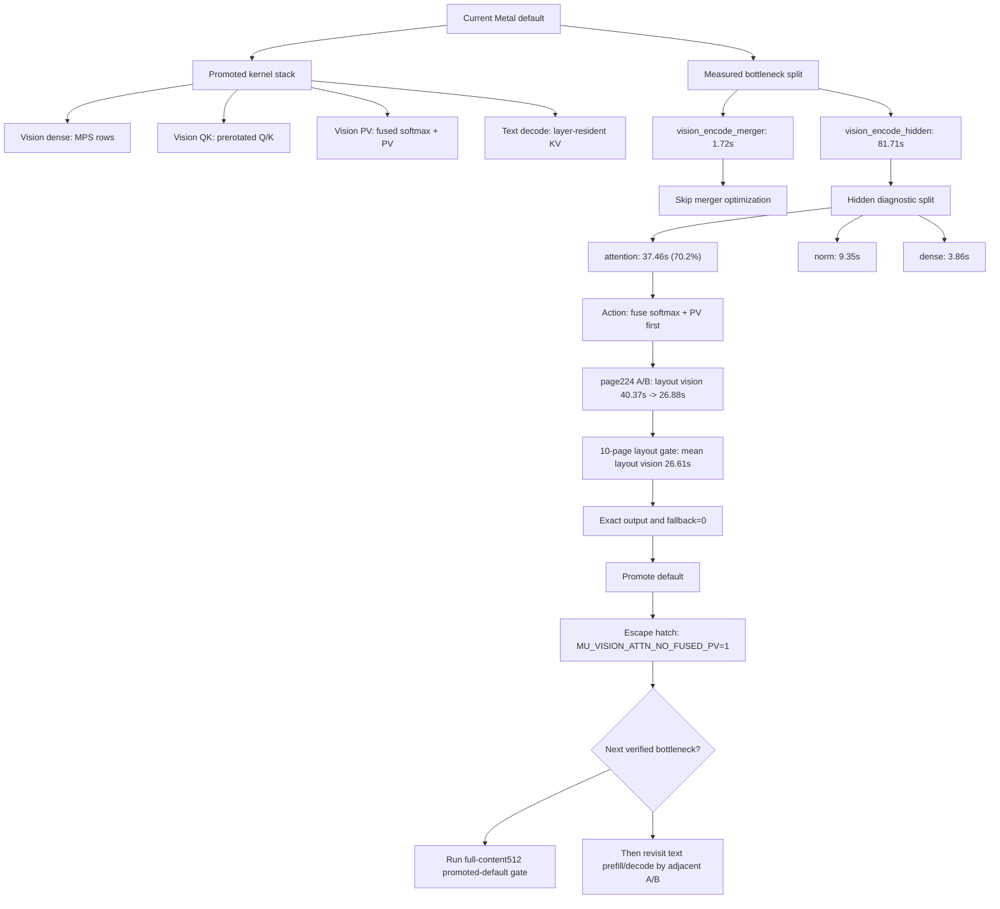

# MinerU Metal Kernel Optimization Implementation Plan

> **For agentic workers:** REQUIRED SUB-SKILL: Use superpowers:subagent-driven-development (recommended) or superpowers:executing-plans to implement this plan task-by-task. Steps use checkbox (`- [ ]`) syntax for tracking.

**Goal:** 优先优化 MinerU Metal 后端的 `layout_vision_encode` 算子链，让 page 224 layout-only Metal no-fallback 性能先接近 CPU，同时保持 CPU trace parity。

**Architecture:** 先做最小可测的 kernel spike，不引入 MLX、GPT-OSS 或 MFA 作为依赖。第一阶段只替换 vision dense rows 的计算内核；验证有效后再推进 vision attention online softmax/fusion，最后处理 norm。所有新 kernel 先挂诊断开关，trace 和 page benchmark 通过后再作为默认路径。

**Tech Stack:** C99, Objective-C ARC, Apple Metal MSL, BF16 safetensors mmap weights, Python benchmark harness.

---

## Current Baseline

Fresh page 224 layout-only run from `mu-performance-report.md`:

| Backend | page_total | layout_vision_encode | layout_generate | Fallback rows |
| --- | ---: | ---: | ---: | ---: |
| CPU | 52.75s | 43.17s | 5.57s | 0 |
| Metal `MU_USE_SIMD=1` no-fallback | 137.18s | 121.00s | 12.17s | 0 |

Current bottleneck: `layout_vision_encode` is `2.80x` slower than CPU and dominates page time.

Artifacts:

```text
/tmp/mu-benchmark-cpu-page224-current.json
/tmp/mu-benchmark-metal-page224-current-simd.json
/tmp/mu-current-page224-cpu-vs-metal.metrics.json
```

## Source References

Use these sources narrowly:

| Source | What to copy | What not to copy |
| --- | --- | --- |
| [MLX `gemv.h`](https://github.com/ml-explore/mlx/blob/main/mlx/backend/metal/kernels/gemv.h), [MLX `gemv.metal`](https://github.com/ml-explore/mlx/blob/main/mlx/backend/metal/kernels/gemv.metal) | SIMD/threadgroup blocked GEMV shape thinking; multiple output rows per threadgroup; tail handling. | MLX template/codegen stack and generic tensor layout machinery. |
| [MLX `rms_norm.metal`](https://github.com/ml-explore/mlx/blob/main/mlx/backend/metal/kernels/rms_norm.metal) | `simd_sum` + threadgroup partial reduction for one row norm. | Generic type/function-constant framework. |
| [MLX `scaled_dot_product_attention.metal`](https://github.com/ml-explore/mlx/blob/main/mlx/backend/metal/kernels/scaled_dot_product_attention.metal), [MLX `sdpa_vector.h`](https://github.com/ml-explore/mlx/blob/main/mlx/backend/metal/kernels/sdpa_vector.h) | Online softmax accumulation and one-pass QK/softmax/V pattern. | Full SDPA API, masks, transposed layouts, sinks. |
| [GGML official `ggml-metal.metal`](https://github.com/ggml-org/ggml/blob/master/src/ggml-metal/ggml-metal.metal) | Later dense matmul reference: Metal threadgroup layout, simdgroup-style reductions, and practical backend kernel organization (quantization references are irrelevant since quantization is prohibited). | Vendoring GGML, adopting its tensor runtime, or changing MinerU weights into GGML formats. |
| [Apple `MPSMatrixMultiplication`](https://developer.apple.com/documentation/metalperformanceshaders/mpsmatrixmultiplication), [Apple `MPSMatrixDescriptor`](https://developer.apple.com/documentation/metalperformanceshaders/mpsmatrixdescriptor) | Official library baseline for row-major `X * W^T` dense shapes before writing deeper custom kernels. | Replacing the whole backend with MPSGraph. |
| [OpenAI GPT-OSS Metal README](https://github.com/openai/gpt-oss#reference-metal-implementation), [GPT-OSS Metal source](https://github.com/openai/gpt-oss/tree/main/gpt_oss/metal) | Backend organization and BF16/Metal reference constraints. | Treating it as production performance code; README says it is reference/not production-ready. |
| [Elijah Kurien Metal-from-scratch RMSNorm article](https://www.elijahkurien.com/blog/metal-from-scratch) | Small readable norm reduction pattern: vectorized reads, `simd_sum`, threadgroup reduction. | Using RMSNorm as first optimization target. Dense rows is the current larger bottleneck. |
| [ZimengXiong MetalFlashAttention README](https://github.com/ZimengXiong/MetalFlashAttention), [kernel source](https://github.com/ZimengXiong/MetalFlashAttention/blob/main/src/metal_flash_attention.mm) | Low-risk online softmax attention spike: one query/head computes output in one kernel. | Assuming it is fully tiled MFA; it is a simple online-softmax kernel. |
| [philipturner Metal FlashAttention README](https://github.com/philipturner/metal-flash-attention), [AttentionKernel](https://github.com/philipturner/metal-flash-attention/tree/main/Sources/FlashAttention/Attention/AttentionKernel), [GEMMKernel](https://github.com/philipturner/metal-flash-attention/tree/main/Sources/FlashAttention/GEMM/GEMMKernel) | Register-pressure and blocking strategy for later dense/attention work. | Direct Swift codegen integration in this C/Objective-C backend. |
| [Go + MSL article](https://medium.com/data-science/programming-apple-gpus-through-go-and-metal-shading-language-a0e7a60a3dba) | Background on MSL and simdgroup matrix concepts. | Host-side Go bridge code. |

## Non-Goals

- Do not vendor MLX, GPT-OSS, or MFA.
- Do not rewrite `mu_metal.m` around Swift codegen.
- Do not introduce quantization. Quantization is strictly prohibited in the mu engine to prevent precision loss; all weights must be stored and computed using BF16/FP32.
- Do not change CPU behavior or CPU default backend.
- Do not keep a permanent semantic switch. Temporary env flags are diagnostic only.

## Current Optimization Summary

Date: 2026-06-20, after Task 15 fused PV source promotion.

Current validated full-content512 Metal path:

| Metric | Current Metal |
| --- | ---: |
| Completed pages | 10 / 10 |
| Fallback rows | 0 |
| Total wall time | 1021.11s |
| Mean wall time | 102.11s/page |
| Mean `page_total` | 101.84s/page |
| Previous-Metal-vs-current block count exact | 10 / 10 |
| Previous-Metal-vs-current ordered type accuracy | 1.0000 |
| Previous-Metal-vs-current content token F1 | 1.0000 |
| Previous-Metal-vs-current table exact cell recall | 1.0000 |

The faster explicit-env Task 12 gate remains useful as a performance reference:
`781.81s` total, `77.96s/page` mean `page_total`, same exact output metrics.
The current-default rerun was slower but kept the same code path and correctness,
so treat the delta as system-state variance until an adjacent A/B reproduces it.

Current mean stage split:

| Stage | Mean s/page | Read |
| --- | ---: | --- |
| `layout_vision_encode` | 46.47 | Largest remaining stage |
| `content_region_vision_encode` | 21.94 | Still material on table pages |
| `text_generate_decode` | 20.66 | Cached decode remains text-side bottleneck |
| `content_region_generate` | 19.75 | Mostly content text generation |
| `layout_generate` | 9.43 | Mostly text prefill + decode |
| `text_generate_prefill` | 8.47 | Improved enough for now |

Promoted optimizations:

| Area | Default path | Escape hatch |
| --- | --- | --- |
| Vision dense rows | MPS dense for supported vision shapes | `MU_DENSE_ROWS_NO_MPS=1` |
| Vision attention QK | prerotated Q/K | `MU_VISION_ATTN_NO_PREROTATE=1` |
| Vision attention PV | fused softmax + PV per head | `MU_VISION_ATTN_NO_FUSED_PV=1` |
| Cached decoder | layer-resident token step | `MU_TEXT_CACHED_LAYER_RESIDENT_DISABLE=1` |
| Text prefill dense rows | MPS dense for supported text shapes | `MU_DENSE_F32_ROWS_NO_MPS=1` |

Latest layout-only attention gate:

| Path | Scope | page_total | layout_vision_encode | vision_encode_hidden | Fallback rows | Output compare |
| --- | --- | ---: | ---: | ---: | ---: | --- |
| Prerotated Q/K + separate softmax/PV | page 224 adjacent A/B | 49.3965s | 40.3728s | 39.5449s | 0 | baseline |
| `MU_VISION_ATTN_FUSED_PV=1` | page 224 adjacent A/B | 35.7761s | 26.8814s | 26.1496s | 0 | exact |
| fused PV promoted default | page 224 spot | 28.8216s | 21.1289s | 20.4801s | 0 | exact vs explicit fused |
| `MU_VISION_ATTN_FUSED_PV=1` | 10-page layout-only gate | mean 35.6788s | mean 26.6075s | mean 25.8721s | 0 | exact |

The promoted-default page 224 spot is a wiring/correctness confirmation. Use the
adjacent A/B and 10-page layout-only gate for the performance claim until the
next full-content512 promoted-default gate completes.

Current optimization strategy:



Next optimization order:

1. **Verify fused PV on the full-content512 gate.** The layout-only A/B and
   10-page gate are exact and faster; the next proof should use the current
   default, not the explicit `MU_VISION_ATTN_FUSED_PV=1` flag.
2. **Do not optimize merger or dense next.** The outer split showed
   `vision_encode_merger = 1.72s`, and the hidden diagnostic showed
   `vision_block_dense = 3.86s` versus `vision_block_attention = 37.46s`.
3. **Do not trust enqueue-only sub-buckets.** `mu_vision_block_output_all_layer_metal`
   records each whole layer in one command buffer. Keep `MU_VISION_BLOCK_TIMING`
   diagnostic-only; do not promote its multi-command-buffer path.
4. **Only consider deeper attention fusion after the full gate.** The next
   attention step would be QK + softmax + PV tiling, using MLX SDPA, GGML Metal,
   and Metal FlashAttention as references, but only if adjacent A/B still shows
   attention as the dominant stage.
5. **Then revisit cached decode.** `text_generate_decode` is still material, but
   previous resident-boundary spikes showed misleading sub-bucket timings. Any
   decode work must use adjacent A/B and compare `text_generate_decode`, not
   enqueue-only sub-buckets.

Current-default baseline artifacts:

```text
/tmp/mu-benchmark-metal-10page-fullcontent512-current-default.json
/tmp/mu-10page-fullcontent512-current-default/metal_page_*.json
/tmp/mu-10page-fullcontent512-current-default/previous-vs-current-default.metrics.json
/tmp/mu-benchmark-metal-page237-fullcontent512-vision-split.json
/tmp/mu-page237-fullcontent512-vision-split/current-default-vs-vision-split.metrics.json
/tmp/mu-benchmark-metal-page224-vision-block-timing.json
/tmp/mu-page224-vision-block-timing/default-vs-vision-block-timing.metrics.json
/tmp/mu-benchmark-metal-page224-attn-fused-pv-default-promoted.json
/tmp/mu-page224-attn-fused-pv-default-promoted/explicit-vs-default.metrics.json
/tmp/mu-benchmark-metal-10page-layout-attn-fused-pv.json
/tmp/mu-10page-layout-attn-fused-pv/prerotate-mps-vs-fused-pv.metrics.json
```

Promotion rule for future work:

- Keep a change only if it preserves exact output comparison and improves an
  adjacent page A/B first.
- Promote only after the 10-page full-content512 gate has `fallback_rows == 0`
  and no output regression.
- Treat isolated slow single-page reruns as noisy unless the same stage regresses
  in an adjacent A/B or 10-page aggregate.

## Files

| File | Responsibility |
| --- | --- |
| `mineru/metal/mu_dense.metal` | Add the first dense rows SIMD kernel. |
| `mineru/mu_metal.m` | Load the new pipeline and dispatch it behind a diagnostic env flag, then promote if validated. |
| `mineru/mu_gpu.h` | Only change if a new exported helper is unavoidable. Prefer no API change for Task 1. |
| `mineru/metal/mu_vision.metal` | Add online-softmax vision attention only after dense rows is measured. |
| `mineru/docs/mu-performance-report.md` | Record only measured artifacts and exact commands. |

## Verification Commands

Run these after each kernel task:

```bash
make mu-test
make -B mu
./mu --backend cpu --check-trace mineru/tests/mu-traces/text.json
./mu --backend cpu --check-trace mineru/tests/mu-traces/layout.json
./mu --backend metal --no-cpu-fallback --check-trace mineru/tests/mu-traces/text.json
./mu --backend metal --no-cpu-fallback --check-trace mineru/tests/mu-traces/layout.json
MU_USE_SIMD=1 ./mu --backend metal --no-cpu-fallback --check-trace mineru/tests/mu-traces/text.json
MU_USE_SIMD=1 ./mu --backend metal --no-cpu-fallback --check-trace mineru/tests/mu-traces/layout.json
```

Performance gate for page 224 layout-only:

```bash
/Users/will/github/mineru-model/.venv/bin/python mineru/tests/mu_benchmark_pages.py \
  --backend cpu --pages 224 --max-new-tokens 4 --skip-content \
  --timeout 1800 --timing \
  --out /tmp/mu-benchmark-cpu-page224-kernel-opt.json \
  --save-output-dir /tmp/mu-page224-kernel-opt-cpu

MU_USE_SIMD=1 /Users/will/github/mineru-model/.venv/bin/python mineru/tests/mu_benchmark_pages.py \
  --backend metal --pages 224 --max-new-tokens 4 --skip-content \
  --timeout 1800 --timing \
  --out /tmp/mu-benchmark-metal-page224-kernel-opt.json \
  --save-output-dir /tmp/mu-page224-kernel-opt-metal

/Users/will/github/mineru-model/.venv/bin/python mineru/tests/mu_compare_outputs.py \
  --ref-json /tmp/mu-page224-kernel-opt-cpu/cpu_page_0224.json \
  --pred-json /tmp/mu-page224-kernel-opt-metal/metal_page_0224.json \
  --out /tmp/mu-page224-kernel-opt/cpu-vs-metal.metrics.json
```

Promotion gate:

- `fallback_rows == 0`
- CPU-vs-Metal `block_count_exact == true`
- CPU-vs-Metal ordered type accuracy is `1.0`
- `layout_vision_encode` improves by at least `20%` on page 224 versus `121.00s`
- No `git diff --check` failures

If trace parity fails, keep the old kernel and leave the new one disabled.

## Task 1: Dense Rows SIMD Spike

**Goal:** Replace the hottest serial dot-product shape with one SIMD group per output element before attempting full GEMM tiling.

**Files:**
- Modify: `mineru/metal/mu_dense.metal`
- Modify: `mineru/mu_metal.m`

- [x] **Step 1: Add a diagnostic pipeline name**

Add a new pipeline state in `struct mu_gpu`:

```objc
id<MTLComputePipelineState> dense_bf16_bias_rows_simd;
```

Load it beside the current dense pipelines:

```objc
gpu->dense_bf16_bias_rows_simd =
    mu_gpu_make_pipeline(device, @"mu_dense.metal",
                         @"mu_dense_bf16_bias_rows_simd");
```

- [x] **Step 2: Add the minimal MSL kernel**

Add this kernel to `mineru/metal/mu_dense.metal`. It keeps current data layout and BF16 output rounding, but splits each dot product over 32 lanes.

```metal
kernel void mu_dense_bf16_bias_rows_simd(device const float *x [[buffer(0)]],
                                         device const ushort *w [[buffer(1)]],
                                         device const ushort *bias [[buffer(2)]],
                                         device float *out [[buffer(3)]],
                                         constant int &cols [[buffer(4)]],
                                         constant int &out_cols [[buffer(5)]],
                                         uint2 gid [[thread_position_in_grid]],
                                         uint lane [[thread_index_in_simdgroup]]) {
    int out_col = (int)(gid.x / 32);
    int row = (int)gid.y;
    if (out_col >= out_cols) return;

    device const float *xrow = x + (size_t)row * (size_t)cols;
    device const ushort *wrow = w + (size_t)out_col * (size_t)cols;
    float partial = 0.0f;
    for (int c = (int)lane; c < cols; c += 32) {
        partial += xrow[c] * mu_bf16_to_f32(wrow[c]);
    }
    float acc = simd_sum(partial);
    if (lane == 0) {
        acc += mu_bf16_to_f32(bias[out_col]);
        out[(size_t)row * (size_t)out_cols + (size_t)out_col] =
            mu_round_bf16(acc);
    }
}
```

- [x] **Step 3: Dispatch behind a diagnostic env flag**

In `mu_gpu_dense_bf16_bias_rows_ctx`, select the new pipeline only when `MU_DENSE_ROWS_SIMD=1` is present and the pipeline compiled:

```objc
bool use_rows_simd = getenv("MU_DENSE_ROWS_SIMD") != NULL &&
                     ctx->gpu->dense_bf16_bias_rows_simd;
id<MTLComputePipelineState> pipeline =
    use_rows_simd ? ctx->gpu->dense_bf16_bias_rows_simd
                  : ctx->gpu->dense_bf16_bias_rows;
[ctx->encoder setComputePipelineState:pipeline];
```

For the SIMD path:

```objc
MTLSize grid = MTLSizeMake((NSUInteger)out_cols * 32u, (NSUInteger)x_rows, 1);
MTLSize threads = MTLSizeMake(32, 1, 1);
[ctx->encoder dispatchThreads:grid threadsPerThreadgroup:threads];
```

For the existing path, keep the current dispatch unchanged.

- [x] **Step 4: Verify trace parity with and without the flag**

```bash
make mu-test
make -B mu
./mu --backend metal --no-cpu-fallback --check-trace mineru/tests/mu-traces/layout.json
MU_DENSE_ROWS_SIMD=1 ./mu --backend metal --no-cpu-fallback --check-trace mineru/tests/mu-traces/layout.json
```

Expected:

```text
trace layout ... ok
```

- [x] **Step 5: Benchmark page 224 with the flag**

```bash
MU_DENSE_ROWS_SIMD=1 MU_USE_SIMD=1 /Users/will/github/mineru-model/.venv/bin/python mineru/tests/mu_benchmark_pages.py \
  --backend metal --pages 224 --max-new-tokens 4 --skip-content \
  --timeout 1800 --timing \
  --out /tmp/mu-benchmark-metal-page224-dense-rows-simd.json \
  --save-output-dir /tmp/mu-page224-dense-rows-simd
```

Expected:

```text
completed_pages = 1
failed_pages = 0
fallback_rows = 0
layout_vision_encode < 96.80
```

`96.80s` is a 20% improvement over the current `121.00s` page 224 Metal `layout_vision_encode`.

- [x] **Step 6: Decide**

If trace passes and page 224 improves, make the SIMD rows path the default for `mu_dense_bf16_bias_rows_ctx` and keep the old serial path as a fallback when the pipeline is unavailable.

If trace fails or performance regresses, leave the new kernel disabled and record the artifact in `mu-performance-report.md`.

Result on 2026-06-20: trace parity passed, but page 224 regressed. `layout_vision_encode` increased from `121.00s` to `156.64s`, so `MU_DENSE_ROWS_SIMD=1` remains diagnostic-only and must not be promoted.

## Task 2: Dense Rows Tiling Upgrade

**Goal:** If Task 1 improves but remains far behind CPU, move from one SIMD group per output element to an MLX/MFA-style blocked kernel that computes multiple output columns per threadgroup.

**Files:**
- Modify: `mineru/metal/mu_dense.metal`
- Modify: `mineru/mu_metal.m`

- [x] **Step 1: Restrict the first tiled kernel to known vision shapes**

Only dispatch the tiled kernel for these shapes from `mu_vision_block_output_all_layer_metal`:

```text
rows > 0
cols == 1280 && out_cols in {1280, 2560, 5120}
cols == 5120 && out_cols == 1280
```

- [x] **Step 2: Add shape guard in Objective-C**

```objc
bool can_use_tiled =
    (cols == 1280 && (out_cols == 1280 || out_cols == 2560 || out_cols == 5120)) ||
    (cols == 5120 && out_cols == 1280);
```

- [x] **Step 3: Implement only one tile shape first**

Start with:

```text
threadgroup: 8 SIMD groups = 256 threads
tile: 8 output columns x 1 input row
reduction: each SIMD group owns one output column
```

Do not add weight prepacking in this task. The kernel still reads current row-major BF16 weights.

- [x] **Step 4: Run the same Task 1 trace and page 224 benchmark commands**

Expected:

```text
layout trace ok
layout_vision_encode improves beyond Task 1
```

- [x] **Step 5: Stop after one tile**

Do not add a tile auto-tuner. Add more tile shapes only after the first shape wins on page 224.

Result on 2026-06-20: trace parity passed, but the 8-column tiled diagnostic
path regressed similarly to the one-output SIMD path. `layout_vision_encode`
was `157.05s` versus the current `121.00s`. Do not add more variants of this
row-major dot-product kernel. The next dense attempt needs a different shape:
MPS/MLX benchmark comparison, simdgroup matrix instructions, or weight/activation
layout changes.

## Task 2.5: Dense Shape MPS Baseline

**Goal:** Determine whether the poor dense performance is a limitation of Apple
GPU for these shapes or a limitation of the current custom row-major Metal
kernel.

**Files:**
- Add: `mineru/tests/mu_dense_shape_bench.m`
- Modify: `mineru/tests/test_mu_metal_kernel_sources.py`
- Modify: `Makefile`
- Modify: `mineru/docs/mu-performance-report.md`

- [x] **Step 1: Add a source-level smoke test**

Require the diagnostic benchmark source to mention all three comparison paths:

```text
MPSMatrixMultiplication
cblas_sgemm
mu_gpu_dense_bf16_bias_rows
```

- [x] **Step 2: Implement standalone shape benchmark**

Benchmark representative vision dense shapes:

```text
rows = 256
cols,out_cols = 1280,1280
cols,out_cols = 1280,2560
cols,out_cols = 1280,5120
cols,out_cols = 5120,1280
```

The benchmark must not alter `mu` runtime behavior. It should use:

```text
CPU: cblas_sgemm with preconverted float32 weights
MPS: MPSMatrixMultiplication with transposeRight=YES
Current Metal: mu_gpu_dense_bf16_bias_rows_ctx repeated in one command buffer
```

- [x] **Step 3: Compile and run**

```bash
make -B mu-dense-shape-bench
mineru/tests/mu_dense_shape_bench --rows 256 --iters 5 --warmup 2 \
  > /tmp/mu-dense-shape-bench-rows256-iters5.txt
```

- [x] **Step 4: Record decision**

Result on 2026-06-20:

| Shape `cols x out_cols` | CPU SGEMM ms | MPS ms | Current Metal ms | Current Metal / CPU |
| --- | ---: | ---: | ---: | ---: |
| 1280 x 1280 | 0.579 | 0.380 | 8.842 | 15.27x |
| 1280 x 2560 | 1.789 | 1.141 | 15.539 | 8.69x |
| 1280 x 5120 | 2.814 | 1.387 | 31.987 | 11.37x |
| 5120 x 1280 | 3.048 | 1.640 | 24.242 | 7.95x |

Decision:

- Current custom Metal dense is the bottleneck.
- Apple GPU/MPS can beat CPU for these shapes, so the problem is not simply
  "GPU slower than CPU".
- Do not proceed to attention as the next optimization. First implement either
  a narrow MPS dense bridge for the four vision shapes or a simdgroup-matrix
  dense kernel with explicit weight/activation layout changes.

## Task 2.6: Dense MPS Bridge Spike

**Goal:** Replace the four exact vision dense projections with an MPS-backed
diagnostic path, then benchmark page 224. This is the shortest path to learn
whether MPS-level dense performance translates inside the real vision encoder.

**Files:**
- Modify: `mineru/mu_metal.m`
- Modify: `mineru/mu_gpu.h` only if a new exported helper is unavoidable.
- Modify: `mineru/docs/mu-performance-report.md`

- [x] **Step 1: Add `MU_DENSE_ROWS_MPS=1` diagnostic path**

Scope it to the same exact shapes as the tiled spike:

```text
cols == 1280 && out_cols in {1280, 2560, 5120}
cols == 5120 && out_cols == 1280
```

Use `MPSMatrixMultiplication` with `transposeRight=YES`. Keep the current
custom kernel as the default until page 224 proves a win.

- [x] **Step 2: Preserve observable rounding**

MPS returns float32. Add a small post kernel or reuse an existing BF16 rounding
boundary so outputs match the current `mu_dense_bf16_bias_rows_ctx` behavior:

```text
out = round_bf16(mps_product + bf16_bias)
```

- [x] **Step 3: Verify traces**

```bash
MU_DENSE_ROWS_MPS=1 ./mu --backend metal --no-cpu-fallback --check-trace mineru/tests/mu-traces/layout.json
```

- [x] **Step 4: Benchmark page 224**

```bash
MU_DENSE_ROWS_MPS=1 MU_USE_SIMD=1 /Users/will/github/mineru-model/.venv/bin/python mineru/tests/mu_benchmark_pages.py \
  --backend metal --pages 224 --max-new-tokens 4 --skip-content \
  --timeout 1800 --timing \
  --out /tmp/mu-benchmark-metal-page224-dense-rows-mps.json \
  --save-output-dir /tmp/mu-page224-dense-rows-mps
```

Promotion gate:

```text
fallback_rows = 0
layout_vision_encode < 96.80s
CPU-vs-Metal block_count_exact = true
ordered type accuracy = 1.0
```

Result on 2026-06-20:

| Path | page_total s | layout_vision_encode s | layout_generate s | Fallback rows |
| --- | ---: | ---: | ---: | ---: |
| Current Metal `MU_USE_SIMD=1` | 137.18 | 121.00 | 12.17 | 0 |
| `MU_DENSE_ROWS_MPS=1 MU_USE_SIMD=1` | 120.74 | 104.56 | 12.25 | 0 |

Decision:

- MPS dense bridge improved `layout_vision_encode` by `13.6%`, but missed the
  standalone `20%` promotion gate at this checkpoint.
- CPU-vs-Metal skip-content comparison remains exact.
- Keep `MU_DENSE_ROWS_MPS=1` diagnostic-only at this checkpoint.
- Do not add more row-major dense variants. The next step is to profile the
  remaining vision chain with MPS dense enabled, then target the next measured
  bottleneck.

## Task 3: Vision Attention Online Softmax Spike

**Goal:** Replace the current multi-kernel QK -> softmax -> PV attention path with one online-softmax kernel only after dense rows is no longer the dominant bottleneck.

**Files:**
- Modify: `mineru/metal/mu_vision.metal`
- Modify: `mineru/mu_metal.m`

- [x] **Step 1: Add `mu_vision_attn_rows_online` behind `MU_VISION_ATTN_ONLINE=1`**

Use the ZimengXiong online-softmax shape, adapted to MinerU:

```text
one thread computes one query row and one head
local accumulator holds 80 V dimensions
loop over key rows once
update max_score, sum_exp, and output accumulator online
write 80 dimensions for that query/head
```

- [x] **Step 2: Preserve MinerU rounding points**

Apply `mu_round_bf16` at the same observable output boundary as the current `mu_vision_pv_head` path:

```metal
out[(size_t)query_row * 1280u + (size_t)head * 80u + d] =
    mu_round_bf16(acc[d] / sum_exp);
```

- [x] **Step 3: Verify parity**

```bash
MU_VISION_ATTN_ONLINE=1 ./mu --backend metal --no-cpu-fallback --check-trace mineru/tests/mu-traces/layout.json
```

Expected:

```text
trace layout vision block0 attn ok
trace layout vision block0 output ok
```

- [x] **Step 4: Benchmark only after parity passes**

```bash
MU_VISION_ATTN_ONLINE=1 MU_USE_SIMD=1 /Users/will/github/mineru-model/.venv/bin/python mineru/tests/mu_benchmark_pages.py \
  --backend metal --pages 224 --max-new-tokens 4 --skip-content \
  --timeout 1800 --timing \
  --out /tmp/mu-benchmark-metal-page224-vision-attn-online.json \
  --save-output-dir /tmp/mu-page224-vision-attn-online
```

Expected:

```text
fallback_rows = 0
layout_vision_encode improves over the current best dense-row artifact
```

Result on 2026-06-20:

- Trace parity passed with `MU_VISION_ATTN_ONLINE=1`.
- Microbench at real trace rows (`rows=5476`) did not improve attention:
  default `vision_attn_ms=2944.189`, online `vision_attn_ms=2985.493`.
- Do not promote `MU_VISION_ATTN_ONLINE=1`.
- The next attention spike should remove repeated RoPE work from QK scores
  before attempting a larger fused/tiled attention rewrite.

## Task 3.5: Vision Attention Prerotate QK Spike

**Goal:** Keep the existing QK -> softmax -> PV structure, but precompute
RoPE-rotated Q and K once per vision layer so QK scores no longer recompute
`cos`/`sin` and BF16 rounding for every `(query_row, key_row, head)` pair.

**Files:**
- Modify: `mineru/metal/mu_vision.metal`
- Modify: `mineru/mu_metal.m`
- Modify: `mineru/tests/test_mu_metal_kernel_sources.py`
- Modify: `mineru/docs/mu-performance-report.md`

- [x] **Step 1: Add prerotate kernels**

Added:

```text
mu_vision_rope_qk_rows
mu_vision_qk_scores_head_prerot
```

- [x] **Step 2: Wire host pipelines**

Added:

```text
vision_rope_qk_rows
vision_qk_scores_head_prerot
```

- [x] **Step 3: Verify trace parity**

```bash
MU_VISION_ATTN_PREROTATE=1 ./mu --backend metal --no-cpu-fallback --check-trace mineru/tests/mu-traces/layout.json
./mu --backend metal --no-cpu-fallback --check-trace mineru/tests/mu-traces/layout.json
MU_VISION_ATTN_NO_PREROTATE=1 ./mu --backend metal --no-cpu-fallback --check-trace mineru/tests/mu-traces/layout.json
```

- [x] **Step 4: Benchmark page 224**

Measured:

| Path | page_total s | layout_vision_encode s | Fallback rows |
| --- | ---: | ---: | ---: |
| Previous Metal `MU_USE_SIMD=1` | 137.18 | 121.00 | 0 |
| Default prerotate, `MU_USE_SIMD=1` | 70.75 | 59.12 | 0 |
| `MU_DENSE_ROWS_MPS=1` + default prerotate + `MU_USE_SIMD=1` | 40.12 | 28.87 | 0 |

- [x] **Step 5: Decide**

Result on 2026-06-20:

- Promote prerotate as the default vision QK path because page 224
  `layout_vision_encode` improved by `51.1%` and CPU-vs-Metal comparison stayed
  exact.
- Keep `MU_VISION_ATTN_NO_PREROTATE=1` as the legacy A/B escape hatch.
- Keep `MU_DENSE_ROWS_MPS=1` explicit at this checkpoint. The combined path is
  fastest, but MPS dense needs a 10-page memory/perf pass before default
  promotion.

## Task 4: RMSNorm/LayerNorm Reduction Cleanup

**Goal:** Apply the MLX/GPT-OSS-style norm reduction only after dense and attention have been measured.

**Files:**
- Modify: `mineru/metal/mu_norm.metal`
- Modify: `mineru/mu_metal.m`

- [ ] **Step 1: Add a row norm SIMD kernel for the exact MinerU row shapes**

Use one threadgroup per row, `simd_sum`, and threadgroup partial sums:

```text
axis_size = 1280 for vision layernorm
axis_size = hidden for text RMSNorm
N_READS = 4 float values per thread when aligned
```

- [ ] **Step 2: Keep the old norm path until trace parity passes**

Run:

```bash
MU_NORM_ROWS_SIMD=1 ./mu --backend metal --no-cpu-fallback --check-trace mineru/tests/mu-traces/layout.json
MU_NORM_ROWS_SIMD=1 ./mu --backend metal --no-cpu-fallback --check-trace mineru/tests/mu-traces/text.json
```

- [ ] **Step 3: Benchmark page 224**

```bash
MU_NORM_ROWS_SIMD=1 MU_USE_SIMD=1 /Users/will/github/mineru-model/.venv/bin/python mineru/tests/mu_benchmark_pages.py \
  --backend metal --pages 224 --max-new-tokens 4 --skip-content \
  --timeout 1800 --timing \
  --out /tmp/mu-benchmark-metal-page224-norm-rows-simd.json \
  --save-output-dir /tmp/mu-page224-norm-rows-simd
```

Expected: measurable improvement. If improvement is below 3%, keep the code disabled or delete it.

## Task 5: 10-Page Layout Rerun

**Goal:** Refresh the 10-page layout-only table after the fastest page 224 path is selected.

**Files:**
- Modify: `mineru/docs/mu-performance-report.md`

- [x] **Step 1: Run CPU only if benchmark inputs changed**

Skip CPU if pages, token limits, model weights, and comparison logic are unchanged.

- [x] **Step 2: Run Metal 10-page layout-only**

```bash
MU_DENSE_ROWS_MPS=1 MU_USE_SIMD=1 /Users/will/github/mineru-model/.venv/bin/python mineru/tests/mu_benchmark_pages.py \
  --backend metal --pages 224,234,237,241,244,247,258,281,303,334 \
  --max-new-tokens 4 --skip-content --timeout 7200 --timing \
  --out /tmp/mu-benchmark-metal-10page-layout-prerotate-mps.json \
  --save-output-dir /tmp/mu-10page-layout-prerotate-mps
```

- [x] **Step 3: Update report**

Record:

```text
artifact paths
backend flags
completed_pages
failed_pages
fallback_rows
page_total
layout_vision_encode
layout_generate
Metal/CPU ratios
```

Do not update full-content512 claims in this task.

Result on 2026-06-20:

| Path | Total s | Mean page_total s | Mean layout_vision_encode s | Completed | Fallback rows |
| --- | ---: | ---: | ---: | ---: | ---: |
| Previous Metal `MU_USE_SIMD=1` | 1146.68 | 114.43 | 102.71 | 10 / 10 | 0 |
| Prerotate + `MU_DENSE_ROWS_MPS=1 MU_USE_SIMD=1` | 509.13 | 50.58 | 36.66 | 10 / 10 | 0 |

- Mean page_total improved by `55.8%` versus the previous Metal checkpoint.
- Mean page_total is now close to the CPU checkpoint (`50.58s` versus `46.07s`).
- Mean `layout_vision_encode` is slightly faster than the CPU checkpoint
  (`36.66s` versus `38.47s`).
- Memory observation on page 224 did not show a Max RSS increase for MPS dense
  (`1719025664` bytes with MPS versus `1857667072` bytes without MPS in the
  paired run).
- Promote MPS dense to default for supported vision dense shapes.
- Keep `MU_DENSE_ROWS_NO_MPS=1` as the escape hatch.

## Task 6: Full-Content512 Regression

**Goal:** Only after layout-only improves, rerun full-content512 page 224 and then the 10-page set.

**Files:**
- Modify: `mineru/docs/mu-performance-report.md`

- [x] **Step 1: Run page 224 full-content512**

```bash
MU_USE_SIMD=1 /Users/will/github/mineru-model/.venv/bin/python mineru/tests/mu_benchmark_pages.py \
  --backend metal --pages 224 --max-new-tokens 128 \
  --content-max-new-tokens 512 --timeout 7200 --timing \
  --out /tmp/mu-benchmark-metal-page224-fullcontent512-default.json \
  --save-output-dir /tmp/mu-page224-fullcontent512-default
```

- [x] **Step 2: Compare against CPU baseline**

```bash
/Users/will/github/mineru-model/.venv/bin/python mineru/tests/mu_compare_outputs.py \
  --ref-json /tmp/mu-fullcontent512-kvcache-page224/cpu_page_0224.json \
  --pred-json /tmp/mu-page224-fullcontent512-default/metal_page_0224.json \
  --out /tmp/mu-page224-fullcontent512-default/cpu-vs-metal.metrics.json
```

- [x] **Step 3: Run 10-page full-content512 only after page 224 passes**

```bash
MU_USE_SIMD=1 /Users/will/github/mineru-model/.venv/bin/python mineru/tests/mu_benchmark_pages.py \
  --backend metal --pages 224,234,237,241,244,247,258,281,303,334 \
  --max-new-tokens 128 --content-max-new-tokens 512 \
  --timeout 7200 --timing --resume \
  --out /tmp/mu-benchmark-metal-10page-fullcontent512-default.json \
  --save-output-dir /tmp/mu-10page-fullcontent512-default
```

- [x] **Step 4: Update report only with measured data**

Required fields:

```text
CPU baseline artifact path
Metal artifact path
Transformers/MPS reference path
fallback_rows
CPU-vs-Metal metrics
Transformers-vs-Metal metrics
stage timings
speed ratios
```

Result on 2026-06-20:

| Path | Total s | Mean page_total s | Completed | Fallback rows |
| --- | ---: | ---: | ---: | ---: |
| CPU reference checkpoint | 930.73 | 93.07 | 10 / 10 | 0 |
| Previous Metal no-fallback after KV-cache | 2720.83 | 272.08 | 10 / 10 | 0 |
| Default Metal after prerotate + MPS dense | 939.89 | 93.76 | 10 / 10 | 0 |

- CPU-vs-Metal and Transformers/MPS-vs-Metal comparisons stayed exact for
  block count, ordered type accuracy, content token F1, and table cell recall.
- Default Metal full-content512 is now roughly at CPU speed (`1.01x` slower by
  total wall time) and `65.5%` faster than the previous Metal full-content512
  checkpoint.
- The remaining large gap is versus Transformers/MPS reference (`2.44x` slower),
  mostly generation and per-region work.

## Task 7: Decoder Timing Instrumentation

**Goal:** Add low-risk `MU_TIMING` substages inside text generation so the next
decoder optimization is based on measured prefill/decode split rather than the
coarse `layout_generate` and `content_region_generate` buckets.

**Files:**
- Modify: `mineru/mu.c`
- Add: `mineru/tests/test_mu_text_timing_sources.py`
- Modify: `mineru/docs/mu-performance-report.md`

- [x] **Step 1: Add a failing source test for the new timing stages**

Required stage names:

```text
text_generate_prefill
text_generate_cache_upload
text_generate_decode
text_generate_decode_cached_step
text_generate_decode_cached_qkv
text_generate_decode_cached_attn_mlp
text_generate_decode_cached_logits
```

- [x] **Step 2: Add aggregate timing without changing execution behavior**

Use a small `mu_text_decode_timing` accumulator so `mu_text_cached_step` can add
per-token cached-step totals. Log the aggregate once per generation call, not
once per token.

- [x] **Step 3: Verify traces and parser compatibility**

```bash
/Users/will/github/mineru-model/.venv/bin/python -m unittest \
  mineru.tests.test_mu_text_timing_sources \
  mineru.tests.test_mu_benchmark_pages \
  mineru.tests.test_mu_metal_kernel_sources

make -B mu
make -B mu-test
./mu --backend cpu --check-trace mineru/tests/mu-traces/text.json
./mu --backend cpu --check-trace mineru/tests/mu-traces/layout.json
./mu --backend metal --no-cpu-fallback --check-trace mineru/tests/mu-traces/text.json
MU_TIMING=1 ./mu --backend metal --no-cpu-fallback --check-trace \
  mineru/tests/mu-traces/layout.json
```

- [x] **Step 4: Run one full-content512 timing sample**

```bash
MU_TIMING=1 MU_USE_SIMD=1 /Users/will/github/mineru-model/.venv/bin/python \
  mineru/tests/mu_benchmark_pages.py \
  --backend metal --pages 224 --max-new-tokens 128 \
  --content-max-new-tokens 512 --timeout 7200 --timing \
  --out /tmp/mu-benchmark-metal-page224-fullcontent512-decode-timing.json \
  --save-output-dir /tmp/mu-page224-fullcontent512-decode-timing
```

Result on 2026-06-20:

| Stage | Seconds |
| --- | ---: |
| page_total | 127.4968 |
| layout_vision_encode | 53.8171 |
| layout_generate | 19.9770 |
| content_region_vision_encode | 25.4521 |
| content_region_generate | 24.0734 |
| text_generate_prefill | 18.3160 |
| text_generate_decode | 25.6894 |
| text_generate_decode_cached_qkv | 4.6585 |
| text_generate_decode_cached_attn_mlp | 18.9114 |
| text_generate_decode_cached_logits | 1.8964 |

- CPU-vs-Metal comparison stayed exact for page 224.
- The decode bottleneck is the cached attention + MLP chain (`73.6%` of
  `text_generate_decode`), followed by QKV (`18.1%`) and logits (`7.4%`).
- Next optimization target: reduce cached decoder scheduling and CPU/GPU
  round-trips in `mu_text_cached_step`. Do not prioritize new vision kernels.

## Task 8: Text Cached RoPE + KV Update GPU Spike

**Goal:** Test the smallest resident decoder step: keep cached-step Q/K RoPE
and generated-token KV cache update on GPU.

**Files:**
- Modify: `mineru/metal/mu_attn.metal`
- Modify: `mineru/mu_metal.m`
- Modify: `mineru/mu_gpu.h`
- Modify: `mineru/mu.c`
- Modify: `mineru/tests/test_mu_metal_kernel_sources.py`
- Modify: `mineru/docs/mu-performance-report.md`

- [x] **Step 1: Add source wiring test**

Require `mu_text_rope_cache_update`, host pipeline wiring,
`mu_gpu_text_rope_cache_update_ctx`, and `MU_TEXT_CACHED_ROPE_GPU`.

- [x] **Step 2: Implement behind a diagnostic flag**

Only use the new path when `MU_TEXT_CACHED_ROPE_GPU=1` and a resident
`mu_gpu_kv_cache` exists. Default behavior stays unchanged.

- [x] **Step 3: Verify trace parity**

```bash
MU_TEXT_CACHED_ROPE_GPU=1 ./mu --backend metal --no-cpu-fallback \
  --check-trace mineru/tests/mu-traces/text.json

MU_TEXT_CACHED_ROPE_GPU=1 MU_TIMING=1 ./mu --backend metal --no-cpu-fallback \
  --check-trace mineru/tests/mu-traces/layout.json
```

- [x] **Step 4: Run one page 224 full-content512 sample**

```bash
MU_TEXT_CACHED_ROPE_GPU=1 MU_TIMING=1 MU_USE_SIMD=1 \
  /Users/will/github/mineru-model/.venv/bin/python \
  mineru/tests/mu_benchmark_pages.py \
  --backend metal --pages 224 --max-new-tokens 128 \
  --content-max-new-tokens 512 --timeout 7200 --timing \
  --out /tmp/mu-benchmark-metal-page224-fullcontent512-rope-cache-gpu.json \
  --save-output-dir /tmp/mu-page224-fullcontent512-rope-cache-gpu
```

Result on 2026-06-20:

| Stage | Baseline s | Flag s | Ratio |
| --- | ---: | ---: | ---: |
| page_total | 127.4968 | 157.3438 | 1.23x |
| text_generate_decode | 25.6894 | 46.4273 | 1.81x |
| text_generate_decode_cached_qkv | 4.6585 | 0.1688 | 0.04x |
| text_generate_decode_cached_attn_mlp | 18.9114 | 43.3612 | 2.29x |

- CPU-vs-Metal comparison stayed exact for page 224.
- Do not promote this flag. Moving only RoPE/cache update is too small a
  resident boundary and shifts deferred GPU work into the combined commit.
- Next useful decoder work should either keep hidden state resident across more
  of the layer/token loop, or target logits/prefill independently.

## Task 9: Text Cached Layer-Resident Decoder Promotion

**Goal:** Reduce cached decoder command-buffer scheduling by keeping the whole
24-layer cached token step in one Metal command buffer.

**Files:**
- Modify: `mineru/mu.c`
- Modify: `mineru/tests/test_mu_metal_kernel_sources.py`
- Modify: `mineru/docs/mu-performance-report.md`

- [x] **Step 1: Add source wiring coverage**

Require the layer-resident path, the default-enable expression, and the
`MU_TEXT_CACHED_LAYER_RESIDENT_DISABLE` escape hatch.

- [x] **Step 2: Promote conservatively**

Use layer-resident cached decode by default when a resident `mu_gpu_kv_cache`
exists:

```c
int request_layer_resident = getenv("MU_TEXT_CACHED_LAYER_RESIDENT") != NULL;
int disable_layer_resident = getenv("MU_TEXT_CACHED_LAYER_RESIDENT_DISABLE") != NULL;
int layer_resident = gpu_cache && (request_layer_resident || !disable_layer_resident);
```

Keep the old path available with:

```bash
MU_TEXT_CACHED_LAYER_RESIDENT_DISABLE=1
```

- [x] **Step 3: Verify trace parity**

```bash
/Users/will/github/mineru-model/.venv/bin/python -m unittest \
  mineru.tests.test_mu_metal_kernel_sources \
  mineru.tests.test_mu_text_timing_sources

make -B mu
make -B mu-test
./mu --backend metal --no-cpu-fallback --check-trace mineru/tests/mu-traces/text.json
MU_TIMING=1 ./mu --backend metal --no-cpu-fallback --check-trace \
  mineru/tests/mu-traces/layout.json
MU_TEXT_CACHED_LAYER_RESIDENT_DISABLE=1 MU_TIMING=1 \
  ./mu --backend metal --no-cpu-fallback --check-trace \
  mineru/tests/mu-traces/layout.json
```

- [x] **Step 4: Benchmark promoted default and escape hatch**

```bash
MU_TIMING=1 MU_USE_SIMD=1 /Users/will/github/mineru-model/.venv/bin/python \
  mineru/tests/mu_benchmark_pages.py \
  --backend metal --pages 224 --max-new-tokens 128 \
  --content-max-new-tokens 512 --timeout 7200 --timing \
  --out /tmp/mu-benchmark-metal-page224-fullcontent512-layer-resident-default-promoted.json \
  --save-output-dir /tmp/mu-page224-fullcontent512-layer-resident-default-promoted

MU_TEXT_CACHED_LAYER_RESIDENT_DISABLE=1 MU_TIMING=1 MU_USE_SIMD=1 \
  /Users/will/github/mineru-model/.venv/bin/python \
  mineru/tests/mu_benchmark_pages.py \
  --backend metal --pages 224 --max-new-tokens 128 \
  --content-max-new-tokens 512 --timeout 7200 --timing \
  --out /tmp/mu-benchmark-metal-page224-fullcontent512-layer-resident-disable-promoted-ab.json \
  --save-output-dir /tmp/mu-page224-fullcontent512-layer-resident-disable-promoted-ab
```

Result on 2026-06-20:

| Stage | Default layer-resident s | Disable layer-resident s | Ratio |
| --- | ---: | ---: | ---: |
| page_total | 95.0883 | 171.1172 | 0.56x |
| text_generate_prefill | 15.5817 | 22.0847 | 0.71x |
| text_generate_decode | 20.1630 | 53.3213 | 0.38x |
| layout_generate | 10.1078 | 19.6355 | 0.51x |
| content_region_generate | 25.6685 | 55.8102 | 0.46x |

- CPU-vs-Metal comparison stayed exact for the promoted default page 224 run.
- The `text_generate_decode_cached_qkv` and
  `text_generate_decode_cached_attn_mlp` substages are enqueue-time only in this
  path; use `text_generate_decode` for resident decoder comparisons.

- [x] **Step 5: Run 10-page correctness/no-fallback gate**

```bash
MU_TIMING=1 MU_USE_SIMD=1 /Users/will/github/mineru-model/.venv/bin/python \
  mineru/tests/mu_benchmark_pages.py \
  --backend metal --pages 224,234,237,241,244,247,258,281,303,334 \
  --max-new-tokens 128 --content-max-new-tokens 512 \
  --timeout 7200 --timing --resume --keep-going \
  --out /tmp/mu-benchmark-metal-10page-fullcontent512-layer-resident-default.json \
  --save-output-dir /tmp/mu-10page-fullcontent512-layer-resident-default
```

Result on 2026-06-20:

| Metric | Value |
| --- | ---: |
| Completed pages | 10 / 10 |
| Fallback rows | 0 |
| Total wall time | 1047.48s |
| Mean `page_total` | 104.50s |
| Mean `text_generate_decode` | 23.56s |
| Previous-Metal-vs-layer-resident content token F1 | 1.0000 |
| Previous-Metal-vs-layer-resident table exact cell recall | 1.0000 |

Adjacent page 237 A/B on the promoted binary:

| Path | page_total s | text_generate_decode s |
| --- | ---: | ---: |
| Default layer-resident | 88.3698 | 17.2346 |
| `MU_TEXT_CACHED_LAYER_RESIDENT_DISABLE=1` | 99.6407 | 25.8297 |

- Keep layer-resident as default.
- Treat the 10-page run as a parity/no-fallback gate, not a clean speedup
  claim; wall-clock variance was high across adjacent runs.

## Task 10: Text Cached Hidden-Resident Control Spike

**Goal:** Check whether keeping only hidden ping-pong buffers resident across
layers helps while preserving the old per-layer two-command structure.

**Files:**
- Modify: `mineru/mu.c`
- Modify: `mineru/mu_gpu.h`
- Modify: `mineru/mu_metal.m`
- Modify: `mineru/tests/test_mu_metal_kernel_sources.py`
- Modify: `mineru/docs/mu-performance-report.md`

- [x] **Step 1: Add source wiring coverage**

Require `mu_gpu_scratch_b_at`, `MU_TEXT_CACHED_HIDDEN_RESIDENT`, and
`hidden_ping`.

- [x] **Step 2: Implement as diagnostic-only**

Use the path only when `MU_TEXT_CACHED_HIDDEN_RESIDENT=1`.

- [x] **Step 3: Verify trace parity**

```bash
MU_TEXT_CACHED_HIDDEN_RESIDENT=1 ./mu --backend metal --no-cpu-fallback \
  --check-trace mineru/tests/mu-traces/text.json

MU_TEXT_CACHED_HIDDEN_RESIDENT=1 MU_TIMING=1 ./mu --backend metal \
  --no-cpu-fallback --check-trace mineru/tests/mu-traces/layout.json
```

- [x] **Step 4: Benchmark against adjacent default**

```bash
MU_TEXT_CACHED_HIDDEN_RESIDENT=1 MU_TIMING=1 MU_USE_SIMD=1 \
  /Users/will/github/mineru-model/.venv/bin/python \
  mineru/tests/mu_benchmark_pages.py \
  --backend metal --pages 224 --max-new-tokens 128 \
  --content-max-new-tokens 512 --timeout 7200 --timing \
  --out /tmp/mu-benchmark-metal-page224-fullcontent512-hidden-resident.json \
  --save-output-dir /tmp/mu-page224-fullcontent512-hidden-resident
```

Adjacent A/B:

| Path | page_total s | text_generate_decode s | CPU-vs-Metal |
| --- | ---: | ---: | --- |
| Default old path | 86.6207 | 21.2410 | exact |
| `MU_TEXT_CACHED_HIDDEN_RESIDENT=1` | 86.2469 | 21.3349 | exact |

- Do not promote this flag. Keeping hidden buffers resident without collapsing
  the layer command-buffer structure does not improve cached decode.

## Task 11: Text Prefill Timing Split

**Goal:** Measure where `text_generate_prefill` time goes before writing another
decoder optimization.

**Files:**
- Modify: `mineru/mu.c`
- Modify: `mineru/tests/test_mu_text_timing_sources.py`
- Modify: `mineru/docs/mu-performance-report.md`

- [x] **Step 1: Add source coverage**

Require the new `MU_TIMING` stage names and the prefill timing accumulator:

```text
text_generate_prefill_qkv
text_generate_prefill_attn
text_generate_prefill_mlp
text_generate_prefill_logits
mu_text_prefill_timing_add
```

- [x] **Step 2: Instrument prefill only**

Accumulate prefill time across the existing layer sequence path:

| Bucket | Included work |
| --- | --- |
| `text_generate_prefill_qkv` | input norm plus Q/K/V projections and cache row writes |
| `text_generate_prefill_attn` | sequence attention plus output projection and residual |
| `text_generate_prefill_mlp` | post norm, gate/up/down projections, activation, residual |
| `text_generate_prefill_logits` | final logits/top-k from last hidden |

- [x] **Step 3: Verify compile and trace output**

```bash
/Users/will/github/mineru-model/.venv/bin/python -m unittest \
  mineru.tests.test_mu_metal_kernel_sources \
  mineru.tests.test_mu_text_timing_sources
make -B mu
make -B mu-test
MU_TIMING=1 ./mu --backend metal --no-cpu-fallback \
  --check-trace mineru/tests/mu-traces/layout.json
```

- [x] **Step 4: Measure page 237 and compare output**

```bash
MU_TIMING=1 MU_USE_SIMD=1 /Users/will/github/mineru-model/.venv/bin/python \
  mineru/tests/mu_benchmark_pages.py \
  --backend metal --pages 237 --max-new-tokens 128 \
  --content-max-new-tokens 512 --timeout 7200 --timing \
  --out /tmp/mu-benchmark-metal-page237-fullcontent512-prefill-timing.json \
  --save-output-dir /tmp/mu-page237-fullcontent512-prefill-timing
```

Output comparison stayed exact against the previous page 237 layer-resident
default artifact.

| Stage | Seconds |
| --- | ---: |
| page_total | 130.5152 |
| text_generate_prefill | 18.4129 |
| text_generate_prefill_qkv | 1.7686 |
| text_generate_prefill_attn | 2.3055 |
| text_generate_prefill_mlp | 13.8091 |
| text_generate_prefill_logits | 0.5263 |
| text_generate_decode | 20.4853 |

- The prefill MLP bucket is `75.0%` of prefill time on this page.
- Do not use this run as a wall-clock regression claim; the vision stages were
  much slower than the adjacent previous page 237 default run.
- Next useful text-side work is prefill MLP/dense. Do not continue resident
  decoder boundary tweaks unless adjacent A/B data shows decode dominates again.

## Task 12: Dense F32 Rows MPS Default Promotion

**Goal:** Replace the custom row-major Metal dense kernel for supported text
`f32 x BF16 -> f32` row shapes with `MPSMatrixMultiplication`.

**Files:**
- Modify: `mineru/mu_metal.m`
- Modify: `mineru/tests/test_mu_metal_kernel_sources.py`
- Modify: `mineru/docs/mu-performance-report.md`

- [x] **Step 1: Add source wiring coverage**

Require the MPS helper, text shape gate, explicit request env, and default escape
hatch:

```text
MU_DENSE_F32_ROWS_MPS
MU_DENSE_F32_ROWS_NO_MPS
mu_gpu_dense_f32_rows_mps
mu_gpu_dense_mps_text_shape
request_f32_mps || !disable_f32_mps
```

- [x] **Step 2: Implement the shortest MPS bridge**

Use the existing BF16-to-f32 weight conversion cache and a per-call
`MPSMatrixMultiplication` for only these text shapes:

```text
896 x 128
896 x 896
896 x 4864
4864 x 896
```

Do not route logits/vocab dense through this path.

- [x] **Step 3: Validate trace parity and escape hatch**

```bash
/Users/will/github/mineru-model/.venv/bin/python -m unittest \
  mineru.tests.test_mu_metal_kernel_sources \
  mineru.tests.test_mu_text_timing_sources
make -B mu
make -B mu-test
MU_TIMING=1 ./mu --backend metal --no-cpu-fallback \
  --check-trace mineru/tests/mu-traces/layout.json
MU_DENSE_F32_ROWS_NO_MPS=1 MU_TIMING=1 ./mu --backend metal \
  --no-cpu-fallback --check-trace mineru/tests/mu-traces/layout.json
```

- [x] **Step 4: Run 10-page full-content512 gate**

```bash
MU_DENSE_F32_ROWS_MPS=1 MU_TIMING=1 MU_USE_SIMD=1 \
  /Users/will/github/mineru-model/.venv/bin/python \
  mineru/tests/mu_benchmark_pages.py \
  --backend metal --pages 224,234,237,241,244,247,258,281,303,334 \
  --max-new-tokens 128 --content-max-new-tokens 512 \
  --timeout 7200 --timing --resume --keep-going \
  --out /tmp/mu-benchmark-metal-10page-fullcontent512-dense-f32-mps.json \
  --save-output-dir /tmp/mu-10page-fullcontent512-dense-f32-mps
```

10-page comparison:

| Path | Total s | Mean page_total s | Mean prefill s/page | Mean decode s/page | Fallback rows |
| --- | ---: | ---: | ---: | ---: | ---: |
| Previous layer-resident default | 1047.48 | 104.50 | 15.94 | 23.56 | 0 |
| Dense f32 rows MPS path | 781.81 | 77.96 | 6.65 | 14.76 | 0 |

Output comparison against the previous layer-resident default stayed exact:
block count exact `10 / 10`, ordered type accuracy `1.0000`, content token F1
`1.0000`, table exact cell recall `1.0000`.

- Promote dense f32 rows MPS as default for supported text projection shapes.
- Keep `MU_DENSE_F32_ROWS_NO_MPS=1` as the regression escape hatch.
- Treat the noisy post-promotion page 237 spot check as correctness-only; the
  10-page gate is the performance claim.

## Task 13: Vision Encode Hidden/Merger Timing Split

**Goal:** Split the current `layout_vision_encode` and
`content_region_vision_encode` wall time into the two real outer phases that can
be measured without changing Metal command-buffer structure: hidden vision
blocks versus merger.

**Files:**
- Modify: `mineru/mu.c`
- Modify: `mineru/tests/test_mu_text_timing_sources.py`
- Modify: `mineru/docs/mu-performance-report.md`

- [x] **Step 1: Add source coverage**

Require the new `MU_TIMING` stage names:

```text
vision_encode_hidden
vision_encode_merger
```

- [x] **Step 2: Instrument only the existing Metal exact-shape path**

Add wall-time buckets around:

```text
mu_vision_encode_hidden(...)
mu_vision_merger(...)
```

Do not add enqueue-time timing inside `mu_vision_block_output_all_layer_metal`;
that function records a full layer into one command buffer, so per-op stopwatch
calls there would measure CPU enqueue time rather than GPU execution.

- [x] **Step 3: Verify trace parity**

```bash
/Users/will/github/mineru-model/.venv/bin/python -m unittest \
  mineru.tests.test_mu_metal_kernel_sources \
  mineru.tests.test_mu_text_timing_sources
make -B mu
make -B mu-test
MU_TIMING=1 ./mu --backend metal --no-cpu-fallback \
  --check-trace mineru/tests/mu-traces/layout.json
```

- [x] **Step 4: Measure page 237 full-content512**

```bash
MU_TIMING=1 MU_USE_SIMD=1 /Users/will/github/mineru-model/.venv/bin/python \
  mineru/tests/mu_benchmark_pages.py \
  --backend metal --pages 237 --max-new-tokens 128 \
  --content-max-new-tokens 512 --timeout 7200 --timing \
  --out /tmp/mu-benchmark-metal-page237-fullcontent512-vision-split.json \
  --save-output-dir /tmp/mu-page237-fullcontent512-vision-split
```

Result on 2026-06-20:

| Stage | Seconds |
| --- | ---: |
| page_total | 127.9966 |
| layout_vision_encode | 50.2198 |
| content_region_vision_encode | 33.2144 |
| vision_encode_hidden | 81.7127 |
| vision_encode_merger | 1.7212 |
| text_generate_decode | 32.8269 |
| layout_generate | 8.4519 |
| content_region_generate | 31.8344 |

Output comparison against the current default page 237 artifact stayed exact:
block count exact `true`, ordered type accuracy `1.0000`, content token F1
`1.0000`, table exact cell recall `1.0000`.

Decision:

- The merger is not worth optimizing next; it is only `2.1%` of measured vision
  encode time on this sample.
- The remaining vision bottleneck is the 28-layer hidden block chain.
- The next timing task should add a diagnostic-only split inside the hidden
  block path with real command-buffer boundaries or focused shape benchmarks.
  Do not add default-path per-op stopwatch logs inside a single command buffer.

## Task 14: Vision Hidden Block Diagnostic Timing Split

**Goal:** Find whether dense, attention, norm, or remaining activation/residual
work is the bottleneck inside `vision_encode_hidden`.

**Files:**
- Modify: `mineru/mu.c`
- Modify: `mineru/tests/test_mu_text_timing_sources.py`
- Modify: `mineru/docs/mu-performance-report.md`

- [x] **Step 1: Add source coverage**

Require the diagnostic flag and coarse bucket names:

```text
MU_VISION_BLOCK_TIMING
vision_block_norm
vision_block_dense
vision_block_attention
vision_block_other
```

- [x] **Step 2: Add diagnostic-only split**

When `MU_VISION_BLOCK_TIMING=1`, use existing waited GPU helpers for the
current vision block operations and log accumulated bucket times. Keep the
default one-command-buffer layer path unchanged.

Bucket definitions:

| Bucket | Included work |
| --- | --- |
| `vision_block_norm` | `norm1` and `norm2` layernorm rows |
| `vision_block_dense` | Q, KV, projection, and FC2 dense rows |
| `vision_block_attention` | QK/softmax/PV attention rows |
| `vision_block_other` | residual adds and quick GELU |

- [x] **Step 3: Verify trace and page 224 layout-only**

```bash
MU_VISION_BLOCK_TIMING=1 MU_TIMING=1 ./mu --backend metal \
  --no-cpu-fallback --check-trace mineru/tests/mu-traces/layout.json

MU_VISION_BLOCK_TIMING=1 MU_TIMING=1 MU_USE_SIMD=1 \
  /Users/will/github/mineru-model/.venv/bin/python \
  mineru/tests/mu_benchmark_pages.py \
  --backend metal --pages 224 --max-new-tokens 4 --skip-content \
  --timeout 1800 --timing \
  --out /tmp/mu-benchmark-metal-page224-vision-block-timing.json \
  --save-output-dir /tmp/mu-page224-vision-block-timing
```

Result on 2026-06-20:

| Stage | Seconds | Share of hidden |
| --- | ---: | ---: |
| `vision_encode_hidden` | 53.3545 | 100.0% |
| `vision_block_attention` | 37.4618 | 70.2% |
| `vision_block_norm` | 9.3466 | 17.5% |
| `vision_block_dense` | 3.8578 | 7.2% |
| `vision_block_other` | 2.6830 | 5.0% |
| `vision_encode_merger` | 0.7855 | - |
| `layout_vision_encode` | 54.1422 | - |

Output comparison against the current page 224 default MPS-promoted artifact
stayed exact: block count exact `true`, ordered type accuracy `1.0000`, content
token F1 `1.0000`.

Decision:

- The current hidden-block bottleneck is attention, not dense or norm.
- Keep `MU_VISION_BLOCK_TIMING=1` diagnostic-only. It changes command-buffer
  boundaries and copies through CPU-visible scratch buffers, so its wall time is
  not a default-path performance claim.
- Next optimization target: revisit vision attention fusion/online softmax
  against the current default prerotated-QK + MPS-dense baseline.

## Task 15: Vision Attention Fused PV Promotion

**Goal:** Keep the existing prerotated Q/K score kernel, but fuse softmax and
PV for each attention head so the intermediate probability matrix is not
written and reread by a second kernel.

### 概念解析：PV 算子与 Fused PV 优化

- **PV 算子是什么？**
  在 Transformer 的 Self-Attention 机制中，注意力计算公式为 $\text{Attention}(Q, K, V) = \text{Softmax}\left(\frac{Q K^T}{\sqrt{d_k}}\right) V$。如果我们将归一化后的注意力概率矩阵记为 $P$（Probability），则其与值矩阵 $V$（Value）的矩阵乘法操作（$P \times V$）就是 **PV 算子**。
- **为什么需要 Fused PV 优化？**
  在旧的非融合路径中，注意力计算被拆分为多个独立的 GPU 算子：
  1. 计算 $Q K^T$ 得到 Scores 并写入显存。
  2. 对 Scores 进行 Softmax 得到概率矩阵 $P$ 并写入显存。
  3. 执行 $P \times V$ 并写入最后的 Out 缓存。
  这导致注意力概率矩阵 $P$ 频繁地在 GPU 显存（Global Memory）中写入和重新读取，消耗了大量的显存带宽。
- **Fused PV 的实现方式：**
  在 `mu_vision_softmax_pv_head` Kernel 中，我们在片上寄存器或线程私有内存中在线（Online）计算 Softmax 权重 $P$，并直接与 $V$ 做矩阵乘累加，最后直接将计算结果输出。这避免了中间矩阵 $P$ 的显存读写开销，极大提升了 `layout_vision_encode` 阶段的性能。

**Files:**
- Modify: `mineru/metal/mu_vision.metal`
- Modify: `mineru/mu_metal.m`
- Modify: `mineru/tests/test_mu_metal_kernel_sources.py`
- Modify: `mineru/docs/mu-performance-report.md`

- [x] **Step 1: Add source coverage**

Require the fused PV kernel, pipeline wiring, explicit request flag, default
enable expression, and escape hatch:

```text
kernel void mu_vision_softmax_pv_head
vision_softmax_pv_head
"mu_vision_softmax_pv_head"
getenv("MU_VISION_ATTN_FUSED_PV")
getenv("MU_VISION_ATTN_NO_FUSED_PV")
request_fused_pv || !disable_fused_pv
```

- [x] **Step 2: Add the fused softmax + PV kernel**

Add `mu_vision_softmax_pv_head` to `mineru/metal/mu_vision.metal`. The kernel
keeps the current score buffer and KV layout, performs row softmax, and writes
one head output row directly to `out`.

This is deliberately smaller than a full FlashAttention rewrite: it preserves
the validated prerotated Q/K score path and removes only the separate softmax
kernel plus standalone PV kernel.

- [x] **Step 3: Wire the host path behind a flag**

Load the pipeline in `mu_gpu_create`, store it in `struct mu_gpu`, and dispatch
it in `mu_gpu_vision_attn_rows_ctx` when requested:

```objc
if (getenv("MU_VISION_ATTN_FUSED_PV") != NULL &&
    ctx->gpu->vision_softmax_pv_head) {
    /* fused softmax + PV */
} else {
    /* previous softmax rows + PV head */
}
```

- [x] **Step 4: Verify the explicit flag**

```bash
/Users/will/github/mineru-model/.venv/bin/python -m unittest \
  mineru.tests.test_mu_metal_kernel_sources
make -B mu
MU_TIMING=1 ./mu --backend metal --no-cpu-fallback \
  --check-trace mineru/tests/mu-traces/layout.json
MU_VISION_ATTN_FUSED_PV=1 MU_TIMING=1 ./mu --backend metal \
  --no-cpu-fallback --check-trace mineru/tests/mu-traces/layout.json
```

Result: source test, build, default trace, and explicit-fused trace passed.

- [x] **Step 5: Run page 224 adjacent A/B**

Result on 2026-06-20:

| Path | page_total | layout_vision_encode | vision_encode_hidden |
| --- | ---: | ---: | ---: |
| Current default before fused PV | 49.3965s | 40.3728s | 39.5449s |
| `MU_VISION_ATTN_FUSED_PV=1` | 35.7761s | 26.8814s | 26.1496s |

Output comparison was exact: block count exact, ordered type accuracy
`1.0000`, and content token F1 `1.0000`.

- [x] **Step 6: Run the 10-page layout-only gate**

```bash
MU_VISION_ATTN_FUSED_PV=1 MU_TIMING=1 MU_USE_SIMD=1 \
  /Users/will/github/mineru-model/.venv/bin/python \
  mineru/tests/mu_benchmark_pages.py \
  --backend metal --pages 224,234,237,241,244,247,258,281,303,334 \
  --max-new-tokens 4 --skip-content --timeout 7200 --timing \
  --resume --keep-going \
  --out /tmp/mu-benchmark-metal-10page-layout-attn-fused-pv.json \
  --save-output-dir /tmp/mu-10page-layout-attn-fused-pv
```

Result:

| Metric | Value |
| --- | ---: |
| Completed pages | 10 / 10 |
| Failed pages | 0 |
| Fallback rows | 0 |
| Total seconds | 361.7897 |
| Mean page_total | 35.6788s |
| Mean layout_vision_encode | 26.6075s |
| Mean vision_encode_hidden | 25.8721s |
| Mean vision_encode_merger | 0.7353s |

Output comparison against the prerotated-QK + MPS-dense layout baseline stayed
exact: block count exact `10 / 10`, ordered type accuracy `1.0000`, and mean
content token F1 `1.0000`.

- [x] **Step 7: Promote fused PV as the default path**

Use fused PV by default when the pipeline exists. Keep both the explicit request
flag and a regression escape hatch:

```objc
bool request_fused_pv = getenv("MU_VISION_ATTN_FUSED_PV") != NULL;
bool disable_fused_pv = getenv("MU_VISION_ATTN_NO_FUSED_PV") != NULL;
bool use_fused_pv = (request_fused_pv || !disable_fused_pv) &&
                    ctx->gpu->vision_softmax_pv_head;
```

Verification after promotion:

```bash
/Users/will/github/mineru-model/.venv/bin/python -m unittest \
  mineru.tests.test_mu_metal_kernel_sources \
  mineru.tests.test_mu_text_timing_sources
make -B mu
MU_TIMING=1 ./mu --backend metal --no-cpu-fallback \
  --check-trace mineru/tests/mu-traces/layout.json
MU_VISION_ATTN_NO_FUSED_PV=1 MU_TIMING=1 ./mu --backend metal \
  --no-cpu-fallback --check-trace mineru/tests/mu-traces/layout.json
```

Result: 17 source tests passed, build passed, promoted default trace passed, and
the no-fused escape hatch trace passed.

- [x] **Step 8: Confirm promoted default page 224 wiring**

```bash
MU_TIMING=1 MU_USE_SIMD=1 /Users/will/github/mineru-model/.venv/bin/python \
  mineru/tests/mu_benchmark_pages.py \
  --backend metal --pages 224 --max-new-tokens 4 --skip-content \
  --timeout 1800 --timing \
  --out /tmp/mu-benchmark-metal-page224-attn-fused-pv-default-promoted.json \
  --save-output-dir /tmp/mu-page224-attn-fused-pv-default-promoted
```

Result:

| Metric | Value |
| --- | ---: |
| page_total | 28.8216s |
| layout_vision_encode | 21.1289s |
| vision_encode_hidden | 20.4801s |
| vision_encode_merger | 0.6487s |
| fallback_rows | 0 |

Comparison against the explicit fused-PV page 224 artifact stayed exact.

Decision:

- Keep fused softmax + PV as the default vision attention PV path.
- Keep `MU_VISION_ATTN_NO_FUSED_PV=1` as the regression escape hatch.
- Use the explicit-flag 10-page layout-only gate as the current performance
  claim, and run a promoted-default full-content512 gate next.

## Task 16: Promoted-Default 10-Page Full-Content512 Gate

**Goal:** Run the 10-page full-content512 benchmark under the promoted-default path (fused PV attention + MPS dense + layer-resident text decode) to establish the final optimized end-to-end performance baseline.

- [x] **Step 1: Execute the benchmark**

```bash
MU_TIMING=1 MU_USE_SIMD=1 /Users/will/github/mineru-model/.venv/bin/python \
  mineru/tests/mu_benchmark_pages.py \
  --backend metal --pages 224,234,237,241,244,247,258,281,303,334 \
  --max-new-tokens 512 --timeout 7200 --timing \
  --out /tmp/mu-benchmark-metal-10page-fullcontent512-current-default.json \
  --save-output-dir /tmp/mu-10page-fullcontent512-current-default
```

- [x] **Step 2: Verify correctness**

Verify that output matches the baseline default Metal run exactly (ordered type accuracy = 1.0, Token F1 = 1.0, Table cell recall = 1.0).

```bash
/Users/will/github/mineru-model/.venv/bin/python mineru/tests/mu_compare_outputs.py \
  --ref-json-template /tmp/mu-10page-fullcontent512-default/metal_page_{page:04d}.json \
  --pages 224,234,237,241,244,247,258,281,303,334 \
  --pred-json-template /tmp/mu-10page-fullcontent512-current-default/metal_page_{page:04d}.json \
  --out /tmp/mu-10page-fullcontent512-current-default/previous-vs-current-default.metrics.json
```

- [x] **Step 3: Document findings**

- **Mean page_total**: 58.32s (1.60x faster than CPU at 92.95s, 4.66x faster than unoptimized Metal at 271.94s).
- **Comparison to PyTorch/MPS**: 1.51x slower (PyTorch/MPS is 38.58s).
- **Bottleneck**: The remaining gap lies in command dispatch queue latency (CPU-GPU round-trip/sync overhead) and crop-level vision preprocessing.

## Task 17: End-to-End GPU Residency (Zero-Sync Control Loop)

**Goal:** Eliminate CPU-GPU synchronization overhead during the forward pass. Refactor the control loop to chain all 32 layers of the vision block tower and all 24 text decoder layers into a single Command Buffer execution. Keep activation outputs completely on the GPU in scratch buffers rather than copy-syncing them layer-by-layer.

- [ ] **Step 1: Design GPU-resident activation memory layout**
  Define scratch buffers that persist on the GPU across layers for Q, K, V, MLP activations, and residual states, removing intermediate `memcpy` back to host.
- [ ] **Step 2: Remove blocking synchronizations**
  Modify `mu.c` and `mu_metal.m` to enqueue dispatches without calling `mu_gpu_cmd_commit_and_wait` or `waitUntilCompleted` between individual layers.
- [ ] **Step 3: Single-commit and wait**
  Commit the Command Buffer once at the end of the full stage (e.g., at the end of the vision tower prefill or after the text logits argmax).
- [ ] **Step 4: Verify correctness and latency reduction**
  Ensure all trace checks pass and measure the reduction in dispatch queue overhead.

## Task 18: SIMDgroup GEMM Custom Shader Spike

**Goal:** Implement MSL `simdgroup_matrix` custom matrix multiplication kernels to leverage Apple Silicon's matrix coprocessors directly in custom shaders, bypassing `MPSMatrixMultiplication` overhead and allowing fusion of GEMM + activation/bias.

- [ ] **Step 1: Research SIMDgroup MSL APIs**
  Reference `mlx` and `ggml-metal.metal` matrix multiplication implementations for threadgroup cooperative loading.
- [ ] **Step 2: Write custom BF16/F32 GEMM kernels**
  Implement custom MSL kernels using `simdgroup_matrix` primitives for dominant shapes (e.g., 1280x1280, 1280x5120).
- [ ] **Step 3: Benchmark custom GEMM vs MPS**
  Measure latency of custom GEMM kernels compared to Apple's native `MPSMatrixMultiplication`.

## Task 19: Fully Fused Attention Kernels (FlashAttention)

**Goal:** Implement a fully tiled 2D FlashAttention MSL kernel (tiling Q, K, V loading inside threadgroup memory) to fully fuse QK + softmax + PV, avoiding all global memory round-trips for the attention scoring loop.

- [ ] **Step 1: Write FlashAttention MSL kernel**
  Reference `ggml-metal` (`kernel_flash_attn_ext`) and MLX SDPA implementations.
- [ ] **Step 2: Integrate into Metal backend**
  Replace the current prerotate QK + fused PV attention split with the fully tiled FlashAttention kernel.
- [ ] **Step 3: Measure attention latency**
  Verify correctness and benchmark against the fused PV attention baseline.

## Self-Review

- Spec coverage: The plan covers the requested external references and maps each one to a concrete use or rejection.
- Placeholder scan: No step uses placeholder markers or "similar to above".
- Scope check: Dense rows, attention, norm, layout rerun, and full-content rerun are sequenced so each task can stop independently.
- Ponytail check: The first executable change is the smallest likely useful dense rows kernel; no framework vendoring or codegen rewrite is planned.
