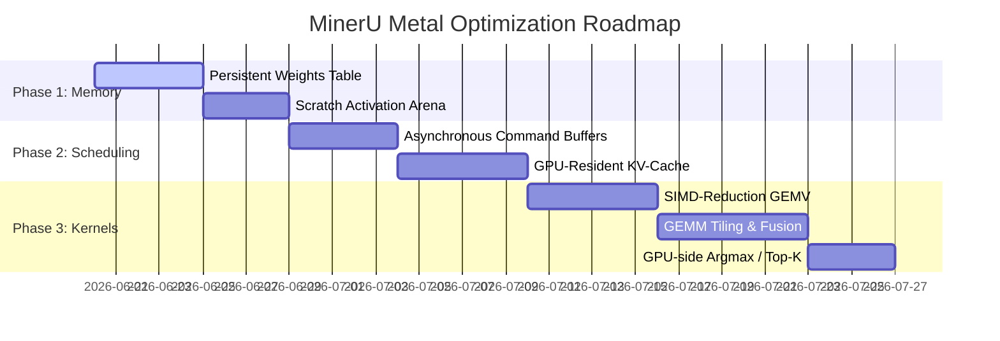

# MinerU Metal Performance Optimization Plan

This document presents the detailed design plan for optimizing the performance of the Metal backend in `ds4/mineru`. The goal is to evolve the current **correctness bridge** into a highly optimized, production-ready inference engine that outperforms or matches `transformers/mps` on Apple Silicon, while maintaining bit-level numerical consistency with the CPU reference path.

---

## 1. Diagnostic Analysis of Existing Bottlenecks

Based on telemetry and the code in [mu_metal.m](file:///Users/will/github/ds4/mineru/mu_metal.m), the performance of the current Metal path is restricted by several key bottlenecks:

1.  **Buffer Allocation and Memory Copies**:
    In [mu_metal.m](file:///Users/will/github/ds4/mineru/mu_metal.m#L224-L235), every single matrix multiplication or normalization call invokes `newBufferWithBytes:length:options:` to copy the input vector/matrix, weights (`w_bf16`), and bias. For model weights (which are static), copying megabytes/gigabytes from CPU to GPU during every forward pass introduces a massive bottleneck.
2.  **CPU-GPU Synchronous Execution**:
    Every single kernel invocation calls `[command_buffer waitUntilCompleted]`. This blocks the CPU thread, forcing it to stall until the GPU finishes a single kernel execution before dispatching the next, causing significant scheduling overhead and latency.
3.  **Naive Kernel Implementations**:
    In [mu_dense.metal](file:///Users/will/github/ds4/mineru/metal/mu_dense.metal#L25-L29), the matrix-vector multiplication (GEMV) kernel relies on a sequential loop per thread. It does not utilize threadgroups, shared memory, or SIMD-group shuffles, resulting in poor hardware utilization.
4.  **Bookkeeping and Memory Thrashing**:
    KV-cache updates involve slicing and copying back and forth between CPU memory and GPU buffers. Logits are read back in full (151,936 floats) to the CPU for argmax/sampling at every generation step.

---

## 2. Optimization Proposals

To address these bottlenecks, we propose a multi-phased optimization architecture.

### A. Persistent GPU Weights & Scratch Arenas
We will eliminate runtime buffer allocations by dividing memory allocation into two lifetimes:
*   **Static Weight Buffers**:
    During model initialization (`mu_engine_open`), we map the weights of the Safetensors file. For every model weight tensor, we will create a corresponding `id<MTLBuffer>` once and store it persistently in a lookup table inside `mu_gpu`. During inference, kernels will directly bind these pre-allocated buffers.
    *   *No-Copy Sharing*: When byte-alignment permits (16-byte aligned offsets in Safetensors), we can use `newBufferWithBytesNoCopy:length:options:deallocator:` to directly expose mmap'ed memory to Metal, avoiding duplicate memory usage.
*   **Intermediate Activation Arenas**:
    We will pre-allocate a fixed pool of activation buffers (Ping-Pong buffers) of sufficient capacity (e.g., $(SeqLen \times HiddenDim)$) to pass intermediate activations from one layer to the next entirely on the GPU, avoiding dynamic `newBufferWithLength` calls during step generation.

### B. Asynchronous Command Buffers
Instead of synchronizing the CPU on every kernel dispatch:
1.  We will record all kernel dispatches (RMSNorm, GEMV, FFN, Attention) for a complete forward step (or a full layer stack) inside a single `MTLCommandBuffer`.
2.  We will submit the command buffer asynchronously via `[command_buffer commit]`.
3.  We will only synchronize (`[command_buffer waitUntilCompleted]`) at the end of the forward step when we need to retrieve the final predicted token or the parsed layout blocks.

```
Current: [CPU] -> Submit Kernel -> [GPU] Run -> Wait -> [CPU] -> Submit Kernel -> ...
Optimized: [CPU] -> Encode All Kernels -> Commit -> [GPU] Parallel execution -> Wait (only at end)
```

### C. Fully GPU-Resident KV-Cache
Rather than copying the key-value states back to CPU memory, the KV-cache will reside permanently in GPU-dedicated buffers:
*   During the prefill stage, the key-value outputs of the attention projection are written directly into a pre-allocated KV-cache tensor on the GPU.
*   During the decode stage, the cached attention kernel ([mu_text_attn_cached](file:///Users/will/github/ds4/mineru/mu_gpu.h#L65)) will fetch values directly from the GPU-resident KV-cache.
*   New token K/V projections will write directly to the correct offset in the GPU cache, eliminating CPU-GPU synchronization.

### D. Warp-Level SIMD Reduction & GEMV Optimization
We will replace the naive sequential loop in [mu_dense.metal](file:///Users/will/github/ds4/mineru/metal/mu_dense.metal) with optimized kernels:
*   For GEMV (matrix-vector multiplication, batch size = 1), we will assign a threadgroup (e.g., 32 threads / 1 SIMD-group) to compute each output row.
*   Threads within the SIMD-group will cooperatively load segments of the vector and weights, perform float multiplication, and sum their results using low-latency SIMD shuffles (`simd_sum()`).
*   For GEMM (matrix-matrix multiplication, batch size > 1 in prefill), we will implement tiled block loading into threadgroup shared memory, utilizing memory coalescing to maximize memory bandwidth.

### E. Operator Fusion
To minimize global memory bandwidth bottlenecks, we will fuse contiguous elementwise operations:
*   **RMSNorm + QKV Projection**: Fuse the normalization calculation and QKV projection into a single kernel so that the normalized values do not need to be written to and read from global VRAM.
*   **SwiGLU Fusion**: Combine the Gate projection, Up projection, SiLU activation, and elementwise multiplication into a unified FFN kernel.
*   **GPU-side Argmax**: Create a reduction kernel to compute the argmax token index directly on the GPU, returning only the single selected token ID (4 bytes) instead of the entire vocabulary logits array (600+ KB).

---

## 3. Implementation Roadmap



### Phase 1: Memory and Allocations (Eliminate Alloc Overheads)
1.  Implement weight registration in `mu_gpu` during load. Keep `MTLBuffer` handles cached.
2.  Define intermediate workspace arenas. Bind them during encoder passes.
3.  Verify that page 224 layout and content benchmarks still match CPU references exactly.

### Phase 2: Pipeline Asynchrony (Eliminate CPU-GPU Stalls)
1.  Remove `waitUntilCompleted` from intermediate GPU calls.
2.  Pipeline the vision encoder blocks, only waiting for final spatial-merged embeddings.
3.  Pipeline the decoder layers, synchronizing only at the logit readout.
4.  Move KV-cache allocation and updates fully to GPU buffers.

### Phase 3: Kernel Parallelism & Fusion (Maximize GPU Math Speed)
1.  Implement warp/SIMD-group reduction GEMV in `mu_dense.metal`.
2.  Implement `SwiGLU` and `RMSNorm+Proj` fused kernels.
3.  Implement a GPU-based token argmax helper.

---

## 4. Precision Verification and Parity Policy

As we optimize the kernels, we must preserve exact bit-level parity:
*   **Strict Rounding**: Ensure that any fast-math optimizations do not alter the round-to-nearest-even rules defined in [mu_f32_to_bf16](file:///Users/will/github/ds4/mineru/mu.c#L165).
*   **Accumulation Precision**: Perform internal accumulations (dot products) in float32, only casting to bf16 when writing the final activations to global memory.
*   **Harness Gates**: Run `mu_compare_outputs.py` after each optimization block. The Token F1 score must remain 1.0000.

---

## 5. UMA Memory Architecture & Zero-Copy Mechanics

On Apple Silicon's Unified Memory Architecture (UMA), CPU and GPU share the same physical RAM. However, from an API and hardware execution perspective, there are still critical logical and architectural distinctions between CPU system memory and GPU "video memory":

### A. GPU Private vs. Shared Storage Modes
*   **Shared Mode (`MTLStorageModeShared`)**: 
    Visible to both CPU and GPU. While fast on UMA, writing to shared buffers requires the OS and hardware driver to manage **cache coherency**.
*   **Private Mode (`MTLStorageModePrivate`)**: 
    Only accessible by the GPU. Even in a UMA system, this mode is crucial for:
    *   **Avoiding CPU Cache Pollution**: Intermediate activation tensors (e.g., hidden states between transformer layers) are only read/written by the GPU. Marking them `Private` prevents the GPU's high-bandwidth operations from continuously flushing the CPU's L1/L2/L3 caches.
    *   **GPU Hardware Layout Optimizations**: The GPU can store private buffers in proprietary, hardware-optimized layouts (such as tiled structures or lossless compression) which the CPU cannot parse directly, significantly increasing memory bandwidth efficiency.

### B. The Cost of `newBufferWithBytes`
The current implementation of `mu_metal.m` frequently calls `newBufferWithBytes` to create buffers. Even in a UMA system, this causes **logical memory copies**:
1.  Standard memory allocated via `malloc` or simple arrays is not necessarily page-aligned (requires 16KB alignment on Apple Silicon).
2.  The GPU requires buffers registered with the Input-Output Memory Management Unit (IOMMU) for safe Direct Memory Access (DMA).
3.  To satisfy these constraints, `newBufferWithBytes` allocates a new, page-aligned block of virtual memory and performs a CPU-side `memcpy` to copy the data, consuming valuable memory bandwidth and CPU cycles.

### C. Implementing Zero-Copy (No-Copy) Buffers
To achieve true zero-copy performance on Apple Silicon:
1.  **Page-Aligned Allocation**: Allocate CPU memory using page-aligned functions (e.g., `posix_memalign` at 16KB boundaries) or memory map files via `mmap`.
2.  **Pointer Aliasing**: Wrap the aligned pointer in an `MTLBuffer` using the `newBufferWithBytesNoCopy:length:options:deallocator:` constructor. This creates a logical buffer pointing directly to the existing RAM space, enabling the GPU to read the data directly with zero copy overhead.
